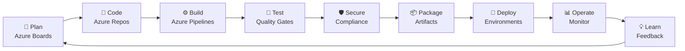
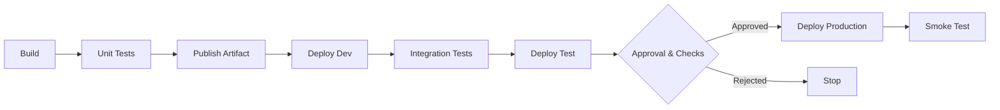

# Azure DevOps: From Fundamentals to Expert Practice

<div align="center">


### A theory, hands-on labs, troubleshooting, and enterprise architecture guide

[](https://learn.microsoft.com/azure/devops/)
[](https://learn.microsoft.com/azure/devops/pipelines/)
[](https://learn.microsoft.com/azure/devops/repos/git/)
[](https://developer.hashicorp.com/terraform)
[](https://kubernetes.io/docs/)
[](https://learn.microsoft.com/credentials/certifications/exams/az-400/)

**Plan · Code · Build · Test · Secure · Release · Deploy · Operate · Learn**

</div>

---

## 📖 About this repository

This repository is a structured path for becoming a capable Azure DevOps practitioner and, through repeated real-world application, an Azure DevOps expert. It combines foundational concepts, guided demonstrations, hands-on labs, production practices, troubleshooting exercises, architecture discussions, and an end-to-end capstone project.

It can be used as:

- A personal learning roadmap
- A reference handbook for daily project work
- An onboarding curriculum for engineering teams
- Instructor-led workshop material
- An interview-preparation guide
- A practical companion for the AZ-400 certification

> [!IMPORTANT]
> Expertise does not come from reading alone. For every topic, explain the concept, build it, break it safely, troubleshoot it, document the decision, and teach it to someone else.

## 🎯 Learning outcomes

By completing this curriculum, you should be able to:

- Design an end-to-end software delivery lifecycle in Azure DevOps
- Organize and measure work using Azure Boards
- Implement secure Git and pull-request workflows in Azure Repos
- Build maintainable multi-stage YAML pipelines
- Create reliable continuous integration and delivery systems
- Manage packages and immutable build artifacts
- Provision Azure infrastructure with Terraform or Bicep
- Deploy applications to Azure services, containers, and Kubernetes
- Apply testing, security, compliance, and governance controls
- Implement approvals, deployment strategies, health checks, and rollback
- Diagnose pipeline, agent, permission, artifact, and deployment failures
- Measure delivery performance and create meaningful feedback loops
- Explain and defend enterprise Azure DevOps architecture decisions

## 🧭 Learning journey



## 🧠 How to study each chapter

Follow the same learning loop throughout the repository:

1. **Understand** — Learn the concepts and terminology.
2. **Explain** — Describe the topic in your own words.
3. **Build** — Complete the guided lab.
4. **Apply** — Relate the design to a real project.
5. **Break** — Introduce a safe, controlled failure.
6. **Troubleshoot** — Find evidence and identify the root cause.
7. **Document** — Record the design, decision, and operational procedure.
8. **Teach** — Present the topic or answer scenario-based questions.

### Suggested pace

| Pace | Weekly effort | Expected duration |
|---|---:|---:|
| Intensive | 12–15 hours | 10–12 weeks |
| Standard | 8–10 hours | 16–18 weeks |
| Part-time | 4–6 hours | 24–28 weeks |

The chapters are intentionally schedule-independent. Choose a pace that allows you to complete the labs rather than rushing through the theory.

---

# Part I — DevOps Foundations

## Chapter 1 — DevOps Principles and Azure DevOps Architecture

### Topics

- DevOps culture, collaboration, feedback, and continuous improvement
- Agile, Scrum, Kanban, and Scrumban
- Continuous integration, continuous delivery, and continuous deployment
- Azure DevOps Services versus Azure DevOps Server
- Organizations, projects, teams, repositories, pipelines, agent pools, and environments
- Azure Boards, Repos, Pipelines, Test Plans, and Artifacts
- Plan-to-production traceability
- DevOps, platform engineering, and site reliability engineering

### Hands-on lab

Create a learning project, add a work item, commit a small application, open a pull request, run a build, and establish traceability between the work item, commit, pull request, build, and artifact.

### Discussion points

- What business problem does DevOps solve?
- What is the difference between delivery and deployment?
- Where do manual handoffs slow down the current project?
- Where is traceability lost between requirement and production?

---

## Chapter 2 — Agile Planning with Azure Boards

### Topics

- Basic, Agile, Scrum, and CMMI processes
- Epics, features, stories or product backlog items, tasks, and bugs
- Area paths and iteration paths
- Backlogs, boards, sprints, queries, dashboards, and delivery plans
- Acceptance criteria, Definition of Ready, and Definition of Done
- Capacity, estimation, velocity, forecasting, and work-in-progress limits
- Lead time, cycle time, throughput, burndown, burnup, and cumulative flow
- Work-item links and end-to-end traceability

### Hands-on lab

Model a feature from epic to task, configure a sprint, set capacity, create operational queries, and build a dashboard for delivery flow and quality.

### Deliverable

Document the team's work-item hierarchy, workflow states, bug policy, sprint cadence, Definition of Ready, Definition of Done, and reporting metrics.

---

# Part II — Source Control and Collaboration

## Chapter 3 — Git Fundamentals

### Topics

- Working directory, staging area, local repository, and remote repository
- Commits, branches, tags, `HEAD`, and commit history
- Clone, fetch, pull, push, merge, and rebase
- Fast-forward and three-way merges
- Conflict resolution
- Reset, restore, revert, and cherry-pick
- Atomic commits, commit messages, and `.gitignore`
- Tags and semantic versioning

### Hands-on lab

Create feature and fix branches, resolve a conflict, revert a bad commit, clean a disposable branch with interactive rebase, tag a release, and recover lost work using Git history.

### Expert question

> A bad commit has reached a shared protected branch. Would you reset or revert it, and why?

---

## Chapter 4 — Azure Repos and Enterprise Branching Strategies

### Topics

- Trunk-based development, short-lived branches, GitFlow, and release branches
- Pull-request lifecycle and reviewer responsibilities
- Required reviewers, build validation, status checks, and comment resolution
- Merge commits, squash merging, rebase, and semi-linear history
- Branch and repository permissions
- Monorepo versus multiple repositories
- Git LFS and repository maintenance
- Hotfix and emergency-change procedures

### Hands-on lab

Protect `main` with pull requests, required reviewers, comment resolution, linked work items, build validation, and controlled merge strategies. Add a pull-request template and a documented emergency bypass process.

### Deliverable

Create a branching strategy that covers naming, merge behavior, releases, hotfixes, tagging, reviewers, bypass permissions, and branch retention.

---

# Part III — Continuous Integration with Azure Pipelines

## Chapter 5 — YAML Pipeline Fundamentals

```text
Pipeline
└── Stage
    └── Job
        └── Step
            └── Task or script
```

### Topics

- YAML structure and schema
- Triggers and pull-request validation
- Stages, jobs, steps, tasks, and scripts
- Microsoft-hosted and self-hosted agents
- Agent pools, capabilities, and demands
- Variables, parameters, and variable groups
- Conditions, dependencies, and outputs
- Artifacts, logging, timeouts, retries, and cancellation

### Expression timing

| Syntax | Evaluation | Typical use |
|---|---|---|
| `${{ }}` | Compile/template time | Parameters and template expansion |
| `$[ ]` | Runtime expression | Conditions and computed variables |
| `$(name)` | Before task execution | Variable substitution in tasks and scripts |

### Hands-on lab

Create a pipeline that restores dependencies, compiles an application, runs unit tests, publishes test and coverage results, and produces a versioned artifact.

---

## Chapter 6 — Continuous Integration Design

### Topics

- Build once, deploy many
- Deterministic and reproducible builds
- Pull-request validation and main-branch CI
- Test pyramids and quality gates
- Dependency caching and parallel execution
- Code coverage and static analysis
- Build numbering and semantic versioning
- Container image creation
- Artifact provenance, retention, and software bills of materials

### Hands-on lab

Create three validation paths:

- **Pull request:** compile, lint, unit test, and scan
- **Main branch:** full test, package, and publish
- **Release tag:** create and retain an immutable release artifact

Measure the pipeline duration before and after safe caching and parallelism.

---

## Chapter 7 — Reusable Pipelines and YAML Templates

### Topics

- Step, job, stage, and variable templates
- Template parameters and data types
- Conditional insertion and `each` loops
- Central template repositories
- Template versioning and compatibility
- Required-template checks
- Governance versus product-team flexibility
- Avoiding excessive abstraction

### Suggested structure

```text
pipelines/
├── application-pipeline.yml
├── templates/
│   ├── build.yml
│   ├── test.yml
│   ├── security-scan.yml
│   └── deploy.yml
└── variables/
    ├── development.yml
    ├── test.yml
    └── production.yml
```

### Hands-on lab

Refactor duplicated pipelines into reusable templates and use the resulting template for at least two sample applications.

---

## Chapter 8 — Artifacts and Dependency Management

### Topics

- Pipeline artifacts and build artifacts
- Azure Artifacts feeds
- NuGet, npm, Maven, Python, and Universal Packages
- Feed scope, permissions, and upstream sources
- Package immutability
- Semantic versioning and dependency pinning
- Promotion and release maturity
- Retention, cleanup, and supply-chain risks

### Hands-on lab

Create a feed, publish a package, consume it from another application, test its permissions, and deploy the exact artifact generated during CI.

---

# Part IV — Continuous Delivery and Deployment

## Chapter 9 — Environments and Multi-stage Deployment Pipelines

### Topics

- CI and CD separation
- Development, test, staging, and production environments
- Deployment jobs and deployment history
- Service connections
- Variable groups, secure files, and Azure Key Vault
- Environment-specific configuration
- Approvals, checks, branch control, business hours, and exclusive locks
- Separation of duties

### Reference flow



### Hands-on lab

Build the flow above using deployment jobs, environment-specific variables, a production approval, branch control, deployment history, and a post-deployment smoke test.

---

## Chapter 10 — Deployment Strategies, Validation, and Rollback

### Topics

- Run-once, rolling, blue-green, and canary deployment
- Feature flags
- Backward-compatible database migration
- Readiness checks and automated validation
- Zero-downtime deployment
- Rollback versus roll-forward
- Recovery objectives and disaster-recovery assumptions

### Hands-on lab

Deploy a new version to an inactive target, validate its health, shift traffic, simulate failure, restore service, and record recovery time.

### Deliverable

Write a production deployment runbook covering preconditions, approvals, deployment, verification, rollback criteria, communication, and incident ownership.

---

# Part V — Infrastructure and Cloud-Native Delivery

## Chapter 11 — Infrastructure as Code

### Topics

- Declarative and imperative provisioning
- Bicep/ARM and Terraform
- Modules and environment parameters
- Terraform state, locking, and remote backends
- Plan or `what-if` before apply
- Drift, idempotency, and lifecycle management
- Policy as code
- Infrastructure testing and destroy protection

### Hands-on lab

Provision a small Azure environment containing an application host, storage or database, Key Vault, monitoring, and role assignments. Add validation, plan, approval, apply, and verification stages.

---

## Chapter 12 — Containers, Azure Container Registry, and Kubernetes

### Topics

- Images, containers, registries, tags, and immutable digests
- Dockerfile layers, build context, and multi-stage builds
- Non-root containers and vulnerability scanning
- Azure Container Registry
- Kubernetes deployments, services, ingress, secrets, and ConfigMaps
- Azure Kubernetes Service
- Helm, Kustomize, and GitOps concepts
- Readiness, liveness, and startup probes

### Hands-on lab

Containerize an application, build it with a multi-stage Dockerfile, scan it, push it to ACR, deploy by immutable digest, verify health, and practice rollback.

---

# Part VI — Quality, Security, and Operations

## Chapter 13 — Testing Strategy and Azure Test Plans

### Topics

- Unit, component, integration, UI, performance, and security testing
- Test pyramid and risk-based testing
- Manual, exploratory, and automated testing
- Test plans, suites, cases, configurations, and runs
- Requirements-to-test traceability
- Test data and environment management
- Flaky-test detection and ownership
- Code coverage versus test effectiveness

### Hands-on lab

Create a test plan, link test cases to requirements, parameterize a case, record a defect from a failed test, publish automated results, and diagnose a deliberately flaky test.

---

## Chapter 14 — Azure DevOps Security and Compliance

### Topics

- Authentication and authorization
- Microsoft Entra ID integration
- Access levels, security groups, permissions, and inheritance
- Least privilege and separation of duties
- Managed identities, service principals, and workload identity federation
- Personal access token risks and lifecycle
- Key Vault, secure files, secret rotation, and log protection
- Static analysis, dependency scanning, secret scanning, image scanning, and IaC scanning
- Audit trails and compliance evidence

### Preferred identity order

```text
Managed identity / workload identity federation
                ↓
            Certificate
                ↓
      Short-lived scoped secret
                ↓
Personal access token only when necessary
```

### Hands-on lab

Audit permissions, create purpose-specific groups, configure a narrowly scoped service connection, eliminate secrets from YAML, add security scans, and confirm that unauthorized deployment is blocked.

---

## Chapter 15 — Monitoring, Feedback, and Troubleshooting

### Topics

- Logs, metrics, traces, and distributed tracing
- Azure Monitor and Application Insights
- Health checks and availability tests
- Service-level indicators, objectives, and error budgets
- Deployment markers and release annotations
- Actionable alerts
- Incident management and blameless postmortems
- Deployment frequency, lead time, change failure rate, and recovery time
- Pipeline analytics and delivery dashboards

### Troubleshooting method

1. Find the failed stage, job, step, or target.
2. Separate platform failure from application failure.
3. Locate the first meaningful error.
4. Review the most recent relevant change.
5. Verify identity, permissions, variables, dependencies, and connectivity.
6. Reproduce the issue with the smallest safe example.
7. Correct the root cause.
8. Add prevention, detection, and documentation.

---

# Part VII — Enterprise Azure DevOps

## Chapter 16 — Governance, Scaling, and Platform Engineering

### Topics

- Organization, project, and team boundaries
- Central platform teams and product-team ownership
- Shared templates and paved-road delivery
- Agent-pool architecture and self-hosted agent security
- Parallel-job capacity and pipeline performance
- Naming, tagging, retention, and lifecycle standards
- Extension governance
- Azure DevOps CLI, REST APIs, and service hooks
- Cost optimization and business continuity
- Migration from classic pipelines to YAML
- Architecture decision records and developer experience

### Architecture challenge

Design a delivery platform for 50 services that provides centralized security controls without forcing every team into an identical application architecture.

---

## Chapter 17 — End-to-End Capstone Project

Build a complete production-style delivery solution:

- [ ] Model requirements in Azure Boards
- [ ] Protect the main branch with policies
- [ ] Implement pull-request validation
- [ ] Compile, test, scan, and package the application
- [ ] Produce a versioned immutable artifact or container
- [ ] Provision infrastructure with Terraform or Bicep
- [ ] Deploy automatically to development
- [ ] Run integration and smoke tests
- [ ] Promote the same artifact to staging
- [ ] Protect production with approvals and checks
- [ ] Use blue-green, rolling, or canary deployment
- [ ] Retrieve configuration and secrets securely
- [ ] Record deployment history and telemetry
- [ ] Demonstrate rollback or roll-forward
- [ ] Create an operational dashboard
- [ ] Present and defend the architecture

### Required documentation

- Architecture diagram
- Repository structure
- Branching and pull-request policy
- CI/CD design
- Environment strategy
- Security and access matrix
- Secrets-management design
- Testing strategy
- Deployment and rollback runbook
- Monitoring and alerting plan
- Disaster-recovery assumptions
- Cost and scaling considerations
- Known risks
- Architecture decision records

---

## Chapter 18 — AZ-400 Preparation and Career Development

The practical curriculum supports AZ-400 preparation, but certification should validate experience rather than replace it.

Microsoft's DevOps Engineer Expert certification currently requires:

1. Azure Administrator Associate **or** Azure Developer Associate
2. AZ-400: Designing and Implementing Microsoft DevOps Solutions

### Recommended preparation sequence

1. Complete Parts I–III.
2. Begin the official AZ-400 learning paths.
3. Complete Parts IV–VII.
4. Finish and present the capstone.
5. Take the official practice assessment.
6. Review weak skill areas.
7. Schedule the exam when you can solve architecture scenarios, not only recall definitions.

> [!NOTE]
> Certification requirements can change. Confirm the latest requirements on the official [Microsoft DevOps Engineer Expert](https://learn.microsoft.com/credentials/certifications/devops-engineer/) page.

---

## 🧪 Recurring failure exercises

Introduce these failures only in a safe learning environment:

- YAML syntax or indentation failure
- Incorrect continuous-integration trigger
- Incorrect branch or stage condition
- Missing repository or pipeline permission
- Unauthorized service connection
- Expired or unavailable credential
- Agent capability mismatch
- Missing runtime dependency
- Incorrect variable-expression syntax
- Template parameter type mismatch
- Missing artifact in a later stage
- Test result not published
- Approval timeout
- Terraform state lock
- Container-registry authentication failure
- Failed readiness or health check
- Incompatible database migration
- Successful pipeline with an unhealthy application

## 💬 Expert scenario questions

1. How would you design CI/CD for 50 microservices without copying YAML?
2. How can production remain protected when developers can edit pipeline code?
3. How do you deploy the same artifact through every environment with different configuration?
4. How would you migrate classic pipelines to YAML without interrupting releases?
5. How should self-hosted agents be designed for a private network?
6. What should happen when a deployment succeeds but the application is unhealthy?
7. How do database changes affect blue-green deployment?
8. How do you grant a vendor access to one repository without exposing the project?
9. How would you safely reduce a 45-minute pipeline to 15 minutes?
10. How do you prevent secrets from entering code, artifacts, container layers, and logs?
11. How do you standardize pipelines without blocking team autonomy?
12. How do you prove which requirement, commit, build, tests, approval, and artifact reached production?
13. How do you deliver an emergency hotfix while preserving auditability?
14. Why might a variable be available in one stage but empty in another?
15. What release controls are appropriate for a regulated system?

## 📊 Skills assessment

Score each competency monthly:

| Level | Meaning | Evidence |
|---:|---|---|
| 0 | Unknown | Cannot explain the topic |
| 1 | Aware | Can define the terminology |
| 2 | Practitioner | Can implement it with guidance |
| 3 | Independent | Can implement and troubleshoot it |
| 4 | Expert | Can design, defend, optimize, govern, and teach it |

Assess these areas:

- DevOps principles and product flow
- Azure Boards and delivery metrics
- Git and Azure Repos
- YAML pipelines and reusable templates
- Continuous integration and quality gates
- Environments, delivery, and deployment strategies
- Artifacts and dependencies
- Testing and Test Plans
- Infrastructure as Code
- Containers, ACR, and AKS
- Identity, security, and compliance
- Monitoring and incident response
- Troubleshooting
- Enterprise governance
- Technical communication and teaching

## 🏗️ Applying the material to a real project

For every chapter, record:

| Question | Purpose |
|---|---|
| What is the current state? | Understand how the project works today |
| What is the risk? | Identify failure, security, and delivery concerns |
| What should the target state be? | Define a realistic improvement |
| What is the smallest safe change? | Avoid disruptive transformation |
| What evidence proves improvement? | Measure the result |

> [!CAUTION]
> Do not change production workflows solely for practice. Build the change in a learning repository or development environment, demonstrate it, receive approval, and introduce it through the team's normal change process.

## 🗂️ Recommended repository structure

```text
azure-devops-expert/
├── README.md
├── CONTRIBUTING.md
├── LICENSE
├── assets/
├── docs/
│   ├── part-01-devops-foundations/
│   ├── part-02-source-control/
│   ├── part-03-continuous-integration/
│   ├── part-04-continuous-delivery/
│   ├── part-05-infrastructure-cloud-native/
│   ├── part-06-quality-security-operations/
│   └── part-07-enterprise-devops/
├── labs/
│   ├── beginner/
│   ├── intermediate/
│   └── advanced/
├── examples/
│   ├── yaml-pipelines/
│   ├── terraform/
│   ├── bicep/
│   ├── docker/
│   └── kubernetes/
├── diagrams/
├── checklists/
├── troubleshooting/
├── interview-preparation/
├── capstone-project/
└── progress-tracker/
```

## 📝 Standard chapter template

Every detailed chapter should use a consistent teaching structure:

```markdown
# Chapter Title

## Learning Objectives
## Prerequisites
## Key Terminology
## Conceptual Overview
## Architecture and Workflow
## Important Azure DevOps Features
## Guided Demonstration
## Hands-on Lab
## Application to a Real Project
## Common Mistakes
## Troubleshooting Scenarios
## Security Considerations
## Production Best Practices
## Discussion Questions
## Interview Questions
## Knowledge Check
## Chapter Assignment
## Expected Deliverables
## Further Reading
```

## 🚀 Getting started

1. Fork or clone this repository.
2. Create a personal learning branch.
3. Start with Chapter 1, even if you already use Azure DevOps.
4. Create a separate Azure DevOps learning project.
5. Complete the lab and save non-sensitive evidence.
6. Record questions and lessons learned.
7. Open a pull request for your completed notes or examples.
8. Reassess your skills after each Part.

## 🔗 Official learning resources

- [Azure DevOps documentation](https://learn.microsoft.com/azure/devops/)
- [Azure Boards documentation](https://learn.microsoft.com/azure/devops/boards/)
- [Azure Repos documentation](https://learn.microsoft.com/azure/devops/repos/)
- [Azure Pipelines documentation](https://learn.microsoft.com/azure/devops/pipelines/)
- [Azure Test Plans documentation](https://learn.microsoft.com/azure/devops/test/)
- [Azure Artifacts documentation](https://learn.microsoft.com/azure/devops/artifacts/)
- [Azure DevOps security guidance](https://learn.microsoft.com/azure/devops/organizations/security/security-overview)
- [Azure DevOps Analytics and reporting](https://learn.microsoft.com/azure/devops/report/)
- [Microsoft DevOps Engineer Expert certification](https://learn.microsoft.com/credentials/certifications/devops-engineer/)
- [AZ-400 exam page](https://learn.microsoft.com/credentials/certifications/exams/az-400/)

## 🤝 Contributing

Contributions that improve explanations, fix errors, add safe labs, or document reproducible troubleshooting scenarios are welcome. Avoid committing credentials, tokens, customer information, internal URLs, proprietary source code, or organization-specific secrets.

## 🔐 Security notice

- Never commit credentials or personal access tokens.
- Use sanitized examples and synthetic data.
- Scope service connections and identities to the minimum required access.
- Prefer managed identities or workload identity federation over stored secrets.
- Run destructive labs only in disposable learning environments.

## 📌 Project status

This is a living learning handbook. Topics, examples, and certification references should be reviewed periodically as Azure DevOps evolves.

---

<div align="center">

### Learn it. Build it. Break it safely. Fix it. Document it. Teach it.

If this repository helps you, consider giving it a ⭐ and sharing what you learned.

</div>
