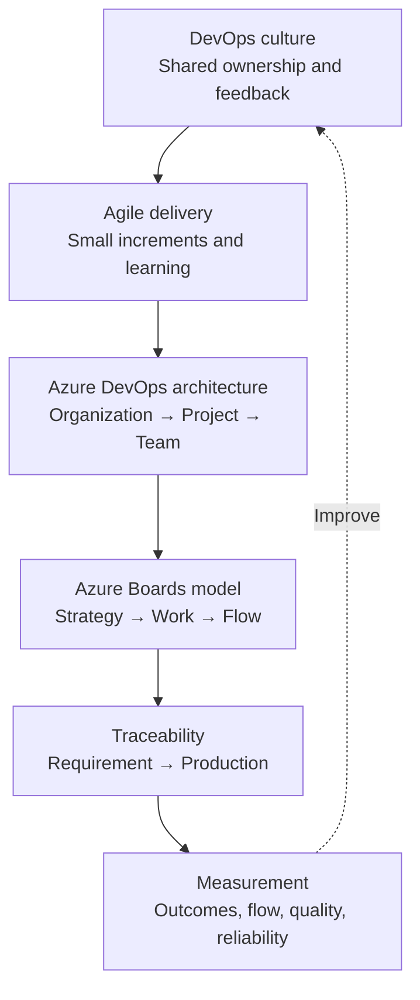

# Part I — DevOps Foundations

[← Complete curriculum](../README.md)

## Why this Part matters

Tools can automate a weak process, but they cannot create shared ownership, customer focus, reliable feedback, or sound product decisions. Part I establishes the thinking and operating model required before designing repositories, pipelines, security controls, or deployment platforms.

This Part connects two foundations:

1. **DevOps as an operating model** — how people, processes, and technology work together to deliver and operate valuable software.
2. **Azure Boards as a planning system** — how strategy, customer needs, delivery work, code changes, tests, builds, and deployments become visible and traceable.

A learner who completes this Part should understand not only where to click in Azure DevOps, but why the platform is structured as it is, how work flows through it, and how to choose practices that fit a real team.

## What you will learn

### Chapter 1 — DevOps Principles and Azure DevOps Architecture

You will learn:

- What DevOps is—and what it is not
- How Agile, Scrum, Kanban, and Scrumban relate to DevOps
- The differences among continuous integration, continuous delivery, and continuous deployment
- When Azure DevOps Services or Azure DevOps Server is appropriate
- How organizations, projects, teams, repositories, pipelines, agents, and environments relate
- How Azure Boards, Repos, Pipelines, Test Plans, and Artifacts work together
- How to establish requirement-to-production traceability
- How DevOps, platform engineering, and site reliability engineering complement one another

[Open Chapter 1 →](chapter-01-devops-principles-and-architecture/README.md)

### Chapter 2 — Agile Planning with Azure Boards

You will learn:

- How to choose among the Basic, Agile, Scrum, and CMMI processes
- How to model epics, features, stories or backlog items, tasks, bugs, risks, and impediments
- How teams use Area Paths and Iteration Paths
- How backlogs, boards, sprints, queries, and dashboards answer different questions
- How Definition of Ready and Definition of Done improve flow and quality
- How capacity, estimation, velocity, and forecasting should—and should not—be used
- How to interpret lead time, cycle time, throughput, WIP, burndown, and cumulative flow
- How links create end-to-end delivery traceability

[Open Chapter 2 →](chapter-02-agile-planning-with-azure-boards/README.md)

## Part learning map

## How this Part will help you

### In daily project work

You will be able to interpret your project's structure, participate confidently in planning discussions, explain how work should be represented, identify missing traceability, and distinguish useful metrics from misleading ones.

### In architecture and leadership discussions

You will be able to explain project and team boundaries, compare cloud and on-premises Azure DevOps, recommend an Agile planning approach, and connect delivery practices to business outcomes.

### In interviews

You will be ready for questions that test judgment rather than memorization—for example, why DevOps is not merely CI/CD, why velocity must not be used to compare teams, and how a production deployment can be traced back to a requirement.

### In future Parts

This foundation supports every later subject. Branch policies need work-item context. Pipelines need clear delivery stages. approvals need ownership boundaries. Metrics need meaningful workflow states. Security needs an understood resource hierarchy.

## Recommended prerequisites

No Azure DevOps experience is required. Familiarity with software delivery is helpful. For the practical exercises, use a non-production Azure DevOps organization or a project where you are authorized to create learning artifacts.

## Part project

Create a small learning project that demonstrates the complete foundation:

1. Choose and justify a process.
2. Create an Epic, Feature, Story or Backlog Item, and Tasks.
3. Configure one team with Area and Iteration Paths.
4. Create a board workflow and sensible WIP limits.
5. Create a Git repository and a small change linked to the work item.
6. Open and complete a pull request.
7. Run a basic validation pipeline.
8. Link or verify the relationships among work, code, build, and deployment.
9. Create a dashboard containing flow and delivery signals.
10. Write a short retrospective explaining what the system reveals and what it hides.

## Definition of completion

You have completed Part I when you can:

- [ ] Explain DevOps without describing it as a job title or a single tool
- [ ] Compare Agile, Scrum, Kanban, and Scrumban
- [ ] Explain CI, continuous delivery, and continuous deployment accurately
- [ ] Draw the Azure DevOps resource hierarchy
- [ ] Describe the purpose of all five core Azure DevOps services
- [ ] Model work with an appropriate process and hierarchy
- [ ] Configure team scope through Area and Iteration Paths
- [ ] Explain the difference among a backlog, board, sprint, query, and dashboard
- [ ] Interpret flow metrics without using them to evaluate individuals
- [ ] Trace a requirement to code, validation, and deployment
- [ ] Present the Part project and defend your design choices

## Chapters

- [Chapter 1 — DevOps Principles and Azure DevOps Architecture](chapter-01-devops-principles-and-architecture/README.md)
- [Chapter 2 — Agile Planning with Azure Boards](chapter-02-agile-planning-with-azure-boards/README.md)

## Authoritative references

- [What is DevOps?](https://learn.microsoft.com/en-us/devops/what-is-devops)
- [What is Azure DevOps?](https://learn.microsoft.com/en-us/azure/devops/user-guide/what-is-azure-devops)
- [Azure Boards documentation](https://learn.microsoft.com/en-us/azure/devops/boards/)
- [About projects and scaling an organization](https://learn.microsoft.com/en-us/azure/devops/organizations/projects/about-projects)
