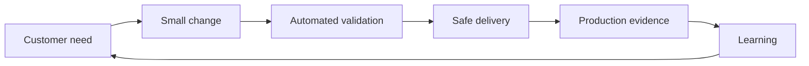

# DevOps Culture and Continuous Improvement

> Chapter 1 — DevOps Principles and Azure DevOps Architecture

[Chapter home](README.md) · [Next →](02-agile-scrum-kanban-and-scrumban.md)

## Purpose

DevOps combines people, process, and technology across planning, development, delivery, and operations. Its purpose is not simply to release faster. It is to deliver customer value quickly **and** safely, learn from real outcomes, and improve the system that produces those outcomes.

## Core mental model

A healthy DevOps system optimizes the complete flow. Improving one department while work waits elsewhere is local optimization, not DevOps.

## Cultural principles

### Shared ownership

Development, testing, security, operations, and product roles share responsibility for customer outcomes. Shared ownership does not mean everyone has identical permissions or skills. It means problems are not discarded at organizational boundaries.

### Customer-centered outcomes

Output is work completed; outcome is the change experienced by users or the business. Ten releases are not automatically better than two. Measures should connect delivery to reliability, adoption, risk reduction, revenue, satisfaction, or another meaningful result.

### Collaboration and visibility

Plans, constraints, incidents, and risks should be visible to the people who can act on them. Azure Boards, Repos, Pipelines, dashboards, and operational telemetry can create visibility, but teams must use consistent practices and discuss what the evidence means.

### Small batches and fast feedback

Smaller changes are easier to understand, test, review, deploy, and reverse. Short feedback loops expose incorrect assumptions before they become expensive.

### Automation with judgment

Automate repeatable work that benefits from consistency: builds, tests, policy validation, provisioning, packaging, deployment, and evidence collection. Retain human judgment for product decisions, exceptional risk, and accountability—not for repetitive copying.

### Learning from failure

Reliable systems expect some failure. Teams reduce impact through testing, progressive delivery, observability, rollback or roll-forward, incident review, and improvement work. A blameless review examines system conditions and decisions; it does not remove accountability.

### Continuous improvement

Improvement is part of delivery capacity. A useful loop is:

1. Make work visible.
2. Identify the largest constraint.
3. Choose a measurable change.
4. Run the experiment.
5. Review evidence.
6. Keep, adjust, or reverse the change.

## What DevOps is not

- A replacement for product management
- A person who owns every deployment tool
- A synonym for Azure DevOps or any vendor product
- Developers receiving unrestricted production access
- Eliminating all approvals regardless of risk
- Releasing frequently without quality or observability
- A one-time transformation project

## Practical project assessment

Interview representatives from product, development, QA, security, and operations. Map one recent change:

| Question | Evidence to collect |
|---|---|
| Why was the change requested? | Work item, customer feedback, incident, objective |
| How long did it wait? | State history and queue time |
| How was it validated? | Test and policy results |
| How was it released? | Pipeline and approval history |
| What happened after release? | Telemetry, incident, adoption, feedback |
| What was learned? | Retrospective or follow-up work |

Look for handoffs, hidden queues, repeated manual work, missing ownership, and feedback that never reaches planning.

## Common failure patterns

- **Tool-first transformation:** purchasing tools before agreeing on outcomes and workflow.
- **Automation theater:** automating a wasteful or unsafe process without redesigning it.
- **Hero culture:** relying on a few people rather than building repeatable capability.
- **Activity metrics:** rewarding tickets closed or deployments performed instead of value and reliability.
- **Blame-driven incidents:** discouraging disclosure and preventing system learning.
- **No improvement capacity:** postponing technical debt and operational work indefinitely.

## Review checklist

- [ ] A business or customer outcome is defined
- [ ] Lifecycle ownership is clear
- [ ] Work and risks are visible
- [ ] Changes are small enough for fast feedback
- [ ] Repeatable validation and delivery steps are automated
- [ ] Production behavior is observable
- [ ] Incidents generate tracked improvement work
- [ ] Metrics evaluate the system, not individual people

## Interview preparation

**Q: What is DevOps?**  
DevOps is a culture and set of practices that unite people, process, and technology across the application lifecycle so teams can deliver reliable customer value continuously and learn from operational feedback.

**Q: Is DevOps the same as CI/CD?**  
No. CI/CD automates integration and delivery. DevOps also includes planning, collaboration, security, operations, feedback, measurement, and organizational behavior.

**Q: How would you begin a DevOps transformation?**  
Start with a value stream and an outcome. Map how one change moves from idea to production, measure waiting and failure, identify the largest constraint, and improve it through a small experiment. Avoid reorganizing everything at once.

**Q: Does shared ownership violate separation of duties?**  
No. Shared ownership concerns outcomes. Separation of duties controls authority. A team can jointly own production quality while protected resources, reviews, and approvals enforce necessary boundaries.

## Further reading

- [What is DevOps? — Microsoft Learn](https://learn.microsoft.com/en-us/devops/what-is-devops)
- [How Microsoft plans with DevOps](https://learn.microsoft.com/en-us/devops/plan/how-microsoft-plans-devops)
