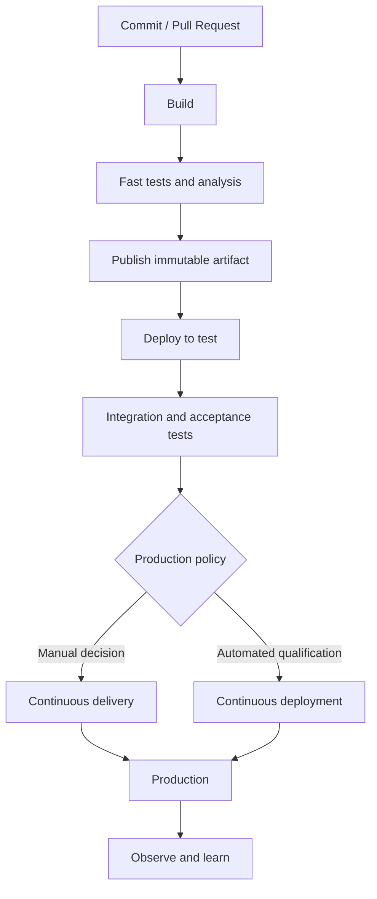

# Continuous Integration, Delivery, and Deployment

> Chapter 1 — DevOps Principles and Azure DevOps Architecture

[← Previous](02-agile-scrum-kanban-and-scrumban.md) · [Chapter home](README.md) · [Next →](04-azure-devops-services-versus-server.md)

## Purpose

CI/CD is frequently used as one phrase, but it describes distinct capabilities. An expert must know where each begins, what evidence it produces, and which risks it controls.

## Definitions

### Continuous integration

Developers integrate small changes frequently into a shared branch. Every integration receives automated validation such as compilation, unit tests, linting, static analysis, and policy checks.

A mature CI system provides a rapid, trustworthy answer to: **Is this change safe to integrate?**

### Continuous delivery

Every accepted change is built, tested, packaged, and kept in a deployable state. Movement toward production is automated and repeatable, but a business or risk decision may still trigger production deployment.

A mature delivery system answers: **Can this exact artifact be released safely when authorized?**

### Continuous deployment

Every change that passes the defined controls is automatically released to production without a manual production decision.

A mature deployment system answers: **Can qualified changes reach users automatically while risk remains controlled?**

## Comparison

| Capability | Integration automated | Deployable artifact | Non-production deployment | Production release |
|---|---:|---:|---:|---|
| CI | Yes | Often | Optional | Manual/outside scope |
| Continuous delivery | Yes | Yes | Automated | On demand or approved |
| Continuous deployment | Yes | Yes | Automated | Automated after controls |

Continuous deployment is not automatically more mature. Regulated, high-risk, or operationally constrained systems may appropriately use continuous delivery with approvals.

## Essential practices

- Integrate frequently and keep branches short-lived
- Build once and promote the same immutable artifact
- Keep pipelines and configuration versioned
- Run fast checks early and slower checks later
- Separate configuration from the artifact
- Protect secrets and deployment identities
- Make failures visible and actionable
- Use deployment health checks
- Prefer safe rollout patterns where risk warrants them
- Record who or what authorized production use

## Reference flow

## Designing a minimum viable pipeline

For a small service:

1. Trigger on pull requests.
2. Restore locked dependencies.
3. Compile or validate.
4. Run unit tests.
5. Run lint and security checks appropriate to risk.
6. Publish test results.
7. On the protected main branch, create a versioned artifact.
8. Deploy that artifact to a learning environment.
9. Run a smoke test.
10. retain evidence and logs.

The pipeline should fail clearly, avoid printing secrets, and not rebuild a different artifact for production.

## Common mistakes

- Calling a nightly build “continuous integration”
- Long-lived branches integrated only near release
- Rebuilding separately for each environment
- Hiding flaky tests by automatically rerunning until green
- Treating a pipeline success as proof the application is healthy
- Adding manual approvals to compensate for weak automated validation
- Embedding environment configuration or credentials in the artifact
- Allowing untrusted pull-request code to access privileged secrets

## Troubleshooting questions

When a pipeline fails, ask:

1. Did source checkout retrieve the intended revision?
2. Is the failure deterministic?
3. Is the agent environment different from local development?
4. Were dependencies pinned and available?
5. Did a condition skip required validation?
6. Does the identity have the minimum required permission?
7. Is the deployment healthy even if the task returned success?
8. Can the exact artifact and configuration be identified?

## Interview preparation

**Q: Continuous delivery versus continuous deployment?**  
Continuous delivery keeps every qualified change deployable and permits an explicit release decision. Continuous deployment releases every qualified change automatically.

**Q: Why build once and deploy many?**  
Rebuilding can produce different outputs because dependencies, tooling, or source state can change. Promoting one immutable artifact preserves evidence that the production artifact is the one already tested.

**Q: Does a manual production approval prevent DevOps?**  
No. An approval can be a valid risk control. The concern is whether it adds informed judgment or merely compensates for unreliable automation.

**Q: How do you improve a slow CI pipeline?**  
Measure stage and test duration; remove redundant work; cache only safe inputs; parallelize independent jobs; order fast high-value checks first; and separate PR validation from exhaustive scheduled checks where appropriate.

## Further reading

- [What is DevOps? — Development and delivery practices](https://learn.microsoft.com/en-us/devops/what-is-devops)
- [Azure Pipelines documentation](https://learn.microsoft.com/en-us/azure/devops/pipelines/)
