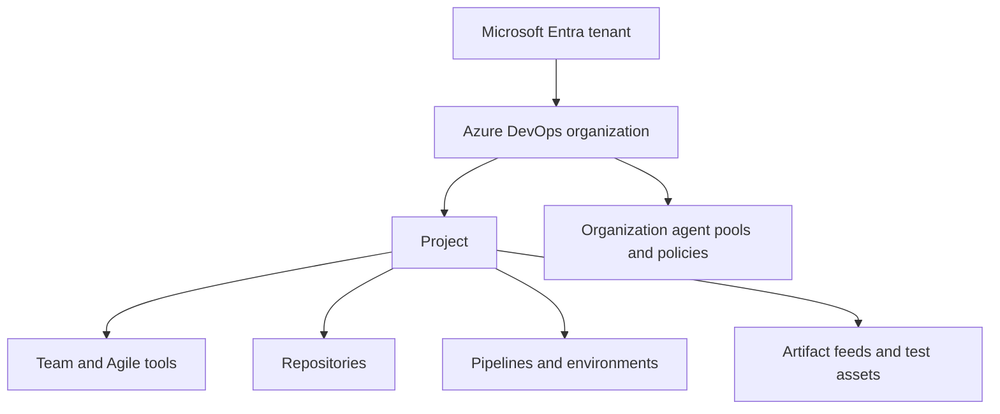

# Organizations, Projects, Teams, and Resources

> Chapter 1 — DevOps Principles and Azure DevOps Architecture

[← Previous](04-azure-devops-services-versus-server.md) · [Chapter home](README.md) · [Next →](06-core-azure-devops-services.md)

## Purpose

Good Azure DevOps architecture begins with correct boundaries. Organizations, projects, and teams are not merely folders. They define administration, visibility, process, security, reporting, and ownership.

## Resource hierarchy

Some resources are organization-scoped and others project-scoped. Always check the specific resource because permissions and reuse depend on scope.

## Organization

An Azure DevOps Services organization is the top-level administrative boundary for projects, users, access levels, policies, billing, extensions, and many shared resources. It normally connects to a Microsoft Entra tenant.

Create multiple organizations only for a clear boundary such as legal separation, identity-tenancy constraints, independent administration, or strong isolation. Multiple organizations make cross-organization reporting, discovery, reuse, and governance harder.

## Project

A project is the primary collaboration and data boundary. It contains work tracking, repositories, pipelines, test assets, dashboards, and project-level settings.

A single project with multiple teams often supports visibility and shared governance well. Add projects when products or business units require distinct administration, processes, access, or lifecycle. Do not create a project for every sprint, release, or small team.

## Team

A team is a configuration and collaboration scope inside a project. Each team receives team-scoped Agile tools such as backlogs, boards, iterations, dashboards, and capacity. The team's selected Area Paths and Iteration Paths determine much of what appears in those tools.

Teams should generally represent durable delivery groups or meaningful portfolio views—not temporary permission groups.

## Common resources and scopes

| Resource | Typical scope | Architectural concern |
|---|---|---|
| Process | Organization/collection | Work-item model shared by projects using it |
| Area and Iteration Paths | Project, selected by teams | Visibility and planning scope |
| Git repository | Project | Code ownership and permissions |
| Pipeline | Project | Execution identity and protected resources |
| Agent pool | Organization; queue exposed to project | Trust, network access, isolation |
| Environment | Project | Deployment history, approvals, permissions |
| Service connection | Project | External identity and least privilege |
| Feed | Organization- or project-scoped depending configuration | Package visibility and permissions |
| Dashboard | Team or project | Audience and ownership |

## Boundary decision rules

Prefer the fewest boundaries that satisfy:

- Identity and access isolation
- Regulatory and legal separation
- Administrative ownership
- Process customization
- Data lifecycle
- Reporting and portfolio visibility
- Service limits
- Product ownership

Every additional boundary has a collaboration cost. Every missing boundary has an isolation or governance cost.

## Example design

A company with one product and four delivery teams might use:

- One organization
- One project for the product
- Four product teams with distinct Area Paths
- Shared repositories where appropriate
- Central agent pools with isolated production access
- Separate environments and service connections for each deployment tier
- A management team selecting multiple Area Paths for portfolio visibility

A separate regulated product might justify its own project or organization after evaluating access and administration requirements.

## Common mistakes

- One organization per team
- One project per microservice without a governance reason
- Using teams only as permission groups
- Overlapping Area Paths that cause duplicated board ownership
- Sharing a privileged agent pool with untrusted pipelines
- Granting project-wide access because resource-level permissions were not designed
- Naming boundaries after temporary initiatives

## Interview preparation

**Q: Project or team—how do you choose?**  
Use a team for a delivery group that can share project administration and process. Use another project when stronger boundaries are needed for administration, access, process, lifecycle, or product separation.

**Q: Why can too many projects be harmful?**  
They fragment backlogs, queries, dashboards, permissions, pipeline templates, discoverability, and reporting, increasing administration and reducing shared visibility.

**Q: What determines which work appears on a team's board?**  
Primarily the team's selected Area Paths, backlog Iteration Path, work-item type, hierarchy position, and workflow state.

## Review checklist

- [ ] Each boundary has a documented reason
- [ ] Team ownership is durable and clear
- [ ] Shared resources have explicit trust assumptions
- [ ] Production resources are isolated appropriately
- [ ] Portfolio reporting works across the chosen structure
- [ ] Names describe products or durable responsibilities

## Further reading

- [About projects and scaling your organization](https://learn.microsoft.com/en-us/azure/devops/organizations/projects/about-projects)
- [About teams and Agile tools](https://learn.microsoft.com/en-us/azure/devops/organizations/settings/about-teams-and-settings)
- [Settings overview](https://learn.microsoft.com/en-us/azure/devops/organizations/settings/about-settings)
