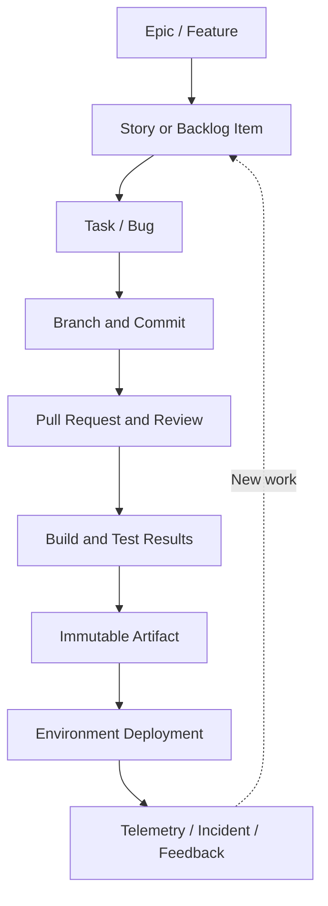

# Plan-to-Production Traceability

> Chapter 1 — DevOps Principles and Azure DevOps Architecture

[← Previous](06-core-azure-devops-services.md) · [Chapter home](README.md) · [Next →](08-devops-platform-engineering-and-sre.md)

## Purpose

Traceability connects business intent to implementation and operational evidence. It should let an authorized person answer:

- Why was this change made?
- What code implemented it?
- Who reviewed it?
- Which validation ran?
- Which artifact was produced?
- Where and when was it deployed?
- What happened after deployment?

Traceability supports troubleshooting, audit, change management, impact analysis, and learning.

## Evidence chain

## Link categories

Azure Boards can represent:

- **Hierarchy:** Parent and Child
- **Dependency:** Predecessor and Successor
- **Association:** Related
- **Defect semantics:** Duplicate, Tested By, Tests, and other supported relations
- **Development links:** branch, commit, pull request, build
- **Deployment evidence:** release or environment information where integration supports it
- **External links:** URLs, GitHub artifacts, remote work items, and supported external objects

Use the most specific meaningful relationship. Excessive Related links create a graph that is difficult to interpret.

## Establishing traceability

### Work to code

Reference the work-item ID in supported commits or associate the branch and pull request through the Azure DevOps interface. Prefer automated and reviewable relationships over manually pasted text.

### Code to validation

Configure branch policy build validation and publish test results. The pipeline run must identify the exact source revision.

### Validation to artifact

Create a unique version. Record source revision and build identity in artifact metadata where possible. Do not overwrite released versions.

### Artifact to deployment

Promote the same artifact across environments. Use deployment jobs and named environments to retain deployment history. Record environment, time, result, and identity.

### Deployment to operations

Add deployment markers or correlate application version with telemetry. Incidents and feedback should identify the deployed version and, where useful, link back to work.

## Traceability test

Select one production version and try to navigate backward to:

- Deployment run and approval
- Artifact version
- Build and test results
- Source commit and pull request
- Work item and acceptance criteria
- Feature or business objective

Then start from the business objective and navigate forward. Any manual guess is a traceability gap.

## Governance principles

- Automate link creation where reliable
- Require linked work items on protected branches when appropriate
- Do not allow meaningless “catch-all” work items
- Retain evidence according to audit and operational needs
- Protect history from unauthorized alteration
- Avoid recording secrets or sensitive data in work-item discussions or logs
- Keep identities and timestamps trustworthy

## Common mistakes

- Writing an ID in a commit message but never verifying the link
- Deploying an artifact that was rebuilt after approval
- Allowing multiple unrelated changes under one vague ticket
- Closing a story before acceptance evidence exists
- Losing pipeline history through overly aggressive retention
- Recording approval in chat while the deployment system has no evidence
- Treating traceability as an audit-only activity rather than a troubleshooting tool

## Interview preparation

**Q: How do you implement end-to-end traceability?**  
Model business work in Boards; associate branches, commits, and pull requests; validate exact revisions in pipelines; publish immutable artifacts; promote those artifacts through named environments; retain deployment evidence; and correlate versions with telemetry and incidents.

**Q: Why is a commit-to-work-item link insufficient?**  
It does not prove review, validation, artifact identity, deployment destination, approval, or operational outcome.

**Q: How would you audit an urgent hotfix?**  
Use an expedited but explicit work-item type or policy, preserve pull-request and validation evidence where possible, record authorization in the protected deployment resource, identify the artifact and deployment, and require a post-change review.

## Practical exercise

Create a small change and build a traceability table:

| Evidence | Identifier/link | Automatically created? | Retention requirement |
|---|---|---:|---|
| Requirement |  |  |  |
| Commit |  |  |  |
| Pull request |  |  |  |
| Build |  |  |  |
| Tests |  |  |  |
| Artifact |  |  |  |
| Deployment |  |  |  |
| Telemetry |  |  |  |

## Further reading

- [Link work items to objects](https://learn.microsoft.com/en-us/azure/devops/boards/backlogs/add-link)
- [Link types reference](https://learn.microsoft.com/en-us/azure/devops/boards/queries/link-type-reference)
- [About work items](https://learn.microsoft.com/en-us/azure/devops/boards/work-items/about-work-items)
