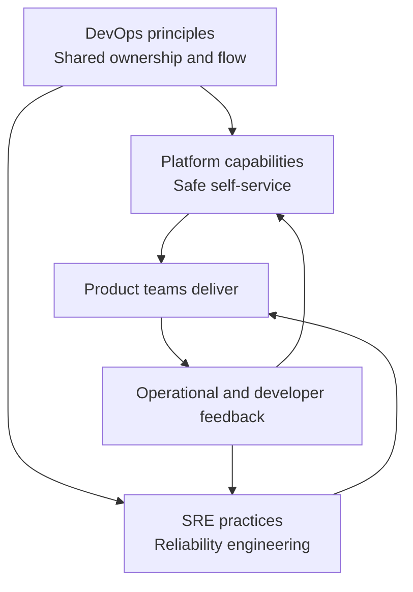

# DevOps, Platform Engineering, and SRE

> Chapter 1 — DevOps Principles and Azure DevOps Architecture

[← Previous](07-plan-to-production-traceability.md) · [Chapter home](README.md)

## Purpose

DevOps, platform engineering, and site reliability engineering overlap, but they answer different questions. Treating them as competing brands creates confusion; treating them as complementary disciplines clarifies responsibility.

## Comparison

| Discipline | Primary concern | Typical question |
|---|---|---|
| DevOps | Culture and lifecycle collaboration | How do we deliver and operate value together? |
| Platform engineering | Reusable internal capabilities and developer experience | How do teams use a safe, supported path without rebuilding everything? |
| SRE | Applying software engineering to reliability | How do we meet reliability objectives efficiently? |

These are operating patterns, not universally standardized org charts.

## DevOps

DevOps spans planning, development, delivery, operations, security, and feedback. It emphasizes shared ownership, flow, automation, and learning.

A DevOps engineer may design pipelines and platforms, but DevOps responsibility cannot be delegated to one person. Product teams, platform teams, security, and operations all contribute.

## Platform engineering

A platform team builds internal products used by delivery teams. Common capabilities include:

- Repository and service templates
- Standard CI/CD components
- Secure identity and secret patterns
- Self-service environments
- Observability defaults
- Approved infrastructure modules
- Documentation and support
- Policy and compliance automation

A “paved road” should make the safe, supported path easier than a custom path. It should be adoptable, observable, versioned, and improved through user feedback.

A platform that mandates every detail without understanding product needs becomes a bottleneck. Measure adoption, task success, wait time, reliability, and developer satisfaction—not the number of platform features produced.

## Site reliability engineering

SRE focuses on reliability through engineering practices. Common ideas include service-level indicators, service-level objectives, error budgets, automation, capacity planning, incident response, and reducing repetitive operational toil.

SRE does not mean “the team that receives production problems.” Product teams must retain service ownership. SRE may provide expertise, shared systems, coaching, or direct ownership depending on the model.

## How they work together

Example:

- DevOps establishes shared ownership and short feedback loops.
- The platform team provides a reusable Azure Pipeline template, federated service connection, approved Terraform module, and observability defaults.
- The product team owns its service and chooses supported options.
- SRE defines reliability indicators, helps design alerts, and improves incident response.
- Evidence from developers and production drives platform and reliability improvements.

## Operating-model decisions

Clarify:

- Which capabilities are self-service?
- Which controls are mandatory?
- Who owns the platform as a product?
- Who supports it and publishes service expectations?
- What may product teams customize?
- Who responds to incidents?
- How are reliability objectives approved?
- How are exceptions reviewed and retired?

## Common failure patterns

- Renaming an operations team “DevOps”
- Building a platform without researching developer needs
- Centralizing every pipeline change in one team
- Offering templates with no versioning or migration path
- Using SRE to absorb product-team operational ownership
- Defining SLOs without user-centered indicators
- Automating provisioning but leaving approval queues unchanged
- Measuring platform output rather than adoption and outcomes

## Interview preparation

**Q: DevOps versus platform engineering?**  
DevOps is a broad culture and lifecycle model. Platform engineering creates reusable internal products that enable teams to practice DevOps consistently and safely.

**Q: DevOps versus SRE?**  
DevOps emphasizes collaboration and delivery across the lifecycle. SRE applies engineering methods to reliability and operations. SRE can be one implementation of DevOps principles.

**Q: What makes an internal platform successful?**  
It solves validated developer problems, provides safe self-service, has clear ownership and support, offers versioned interfaces, measures adoption and outcomes, and allows justified escape paths.

**Q: Who owns production?**  
Ownership should be explicit and shared around outcomes. Product teams should not throw software over a wall; platform and SRE teams enable and support rather than becoming default dumping grounds.

## Practical exercise

For your current organization, create a responsibility map covering:

- Application source and dependencies
- Pipeline templates
- Build and deployment agents
- Cloud infrastructure modules
- Service connections and secrets
- Monitoring and alerts
- Incident response
- Reliability objectives
- Developer support

Identify ambiguous ownership and one repeated task that a platform capability could simplify.

## Further reading

- [What is DevOps?](https://learn.microsoft.com/en-us/devops/what-is-devops)
- [Azure Well-Architected Framework: Operational Excellence](https://learn.microsoft.com/en-us/azure/well-architected/operational-excellence/)
- [Azure reliability documentation](https://learn.microsoft.com/en-us/azure/reliability/)
