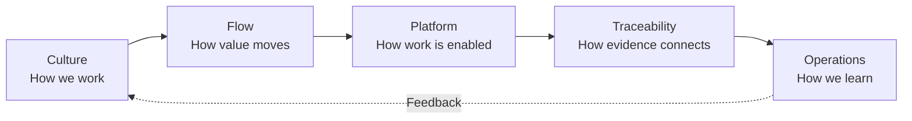

# Chapter 1 — DevOps Principles and Azure DevOps Architecture

[← Part I — DevOps Foundations](../README.md)

## Chapter purpose

This chapter builds the mental model required to use Azure DevOps well. It begins with DevOps culture and delivery principles, then maps those ideas to the Azure DevOps platform. The goal is to understand why the services exist, how their scopes relate, and how they support an auditable path from customer need to production learning.

Azure DevOps is not the same thing as DevOps. DevOps is an organizational capability and way of working. Azure DevOps is a product suite that can support that capability. A team can own the tools and still lack DevOps if work remains siloed, feedback is slow, releases are fragile, or operations are treated as someone else's problem.

## Learning objectives

After completing this chapter, you should be able to:

- Define DevOps in terms of people, process, technology, and outcomes
- Identify cultural and organizational obstacles to DevOps
- Compare Agile, Scrum, Kanban, and Scrumban
- Distinguish continuous integration, delivery, and deployment
- Compare Azure DevOps Services with Azure DevOps Server
- Draw and explain the Azure DevOps resource hierarchy
- Explain the role of Boards, Repos, Pipelines, Test Plans, and Artifacts
- Design a traceability chain from requirement to production
- Explain the boundaries among DevOps, platform engineering, and SRE

## Chapter map

## Topics

1. [DevOps Culture and Continuous Improvement](01-devops-culture-and-continuous-improvement.md)
2. [Agile, Scrum, Kanban, and Scrumban](02-agile-scrum-kanban-and-scrumban.md)
3. [Continuous Integration, Delivery, and Deployment](03-continuous-integration-delivery-and-deployment.md)
4. [Azure DevOps Services versus Azure DevOps Server](04-azure-devops-services-versus-server.md)
5. [Organizations, Projects, Teams, and Resources](05-organizations-projects-teams-and-resources.md)
6. [Core Azure DevOps Services](06-core-azure-devops-services.md)
7. [Plan-to-Production Traceability](07-plan-to-production-traceability.md)
8. [DevOps, Platform Engineering, and SRE](08-devops-platform-engineering-and-sre.md)

## Practical chapter lab

Use a non-production project to create a thin end-to-end delivery path:

1. Write a customer outcome as a work item with acceptance criteria.
2. Create a child implementation task.
3. Create a branch associated with the work item.
4. Commit a small change using the work-item identifier.
5. Open a pull request and review it.
6. Run a build or validation pipeline.
7. Publish a small artifact.
8. Deploy or simulate deployment to a learning environment.
9. Confirm which relationships Azure DevOps created automatically and which required configuration.
10. Draw the resulting evidence chain.

## Architecture discussion

For a real or fictional organization, answer:

- Where should organization and project boundaries be placed?
- Which responsibilities belong to teams, project administrators, and organization administrators?
- Which information must be visible across teams?
- What must be standardized, and what should teams choose?
- What evidence is required to answer “what changed in production and why?”
- Which feedback reaches product planning after release?

## Common chapter misconceptions

| Misconception | Better understanding |
|---|---|
| DevOps means developers perform operations | DevOps establishes shared outcomes and collaboration across the lifecycle |
| Azure DevOps automatically creates DevOps | The platform enables practices; teams must design and sustain them |
| CI/CD is the whole of DevOps | CI/CD is one technical capability within a broader operating model |
| Agile means no planning | Agile uses continual planning and adaptation |
| More projects always improve isolation | Excessive project boundaries can fragment visibility and governance |
| A successful deployment means value was delivered | Technical success must be followed by customer and operational feedback |

## Chapter completion

- [ ] Read every topic
- [ ] Complete the end-to-end lab
- [ ] Draw the Azure DevOps hierarchy without notes
- [ ] Explain CI, delivery, and deployment using one example
- [ ] Present the Services-versus-Server tradeoff
- [ ] Demonstrate a requirement-to-deployment trace
- [ ] Answer the interview questions on each topic
- [ ] Record lessons that apply to your current project
