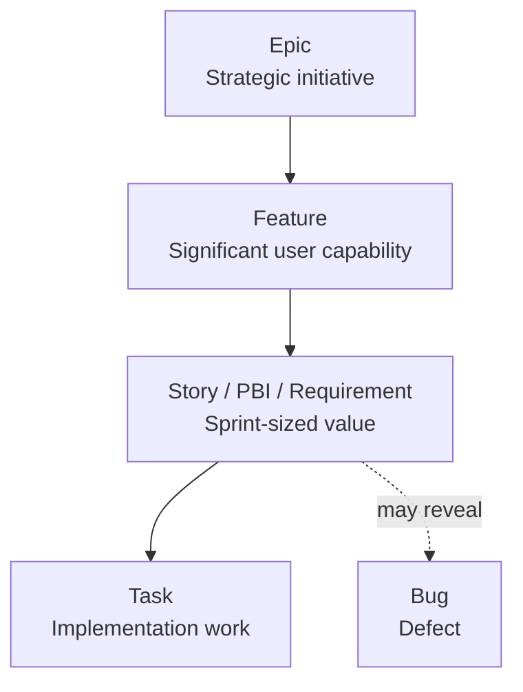

# Work Item Types and Hierarchy

> Chapter 2 — Agile Planning with Azure Boards

[← Previous](01-azure-boards-process-models.md) · [Chapter home](README.md) · [Next →](03-area-paths-and-iteration-paths.md)

## Purpose

Work items create a shared model of intent, scope, ownership, state, and evidence. A good hierarchy connects strategy to small deliverables without turning the backlog into a detailed project plan that becomes obsolete immediately.

## Typical hierarchy

The Basic process differs by using Epic, Issue, and Task by default. Names vary, but the principle remains: higher levels describe outcomes and scope; lower levels describe independently deliverable value and implementation.

## Work-item purposes

### Epic

A large initiative or outcome spanning features, teams, or releases. It should communicate why the investment matters and how success will be evaluated.

### Feature

A significant user or business capability. It commonly contains multiple stories or backlog items and may span sprints.

### Story, Product Backlog Item, or Requirement

A small unit of customer or stakeholder value that can normally be completed within a sprint or short flow interval. It should have understandable acceptance criteria and be independently testable.

### Task

Implementation work required to complete a backlog item. Use tasks when they improve coordination, capacity planning, skill visibility, or handoff clarity. Do not create tasks solely to count activity.

### Bug

A defect where actual behavior differs from expected behavior. Teams can configure whether bugs behave like requirements or tasks. Define severity, priority, reproduction evidence, affected version, and acceptance for correction.

### Issue or impediment

A blocker, risk, or concern separate from planned value. Assign an owner and review date; otherwise impediments become permanent records with no action.

## Slicing work

Prefer vertical slices that deliver observable behavior across necessary layers. “Build database,” “build API,” and “build UI” are horizontal components; “customer can update delivery address” is a vertical capability.

Useful splitting dimensions include:

- User workflow step
- Business rule
- Happy path versus exceptions
- Data variation
- Role or persona
- Interface or channel
- Operational capability
- Risky discovery versus implementation

A backlog item that cannot finish in the expected cadence should be split or treated as a higher-level item.

## Hierarchy rules

- Keep each work-item type flat within its own level
- Link hierarchy across levels: Epic → Feature → Story/PBI → Task
- Give each child one clear parent
- Avoid deep custom hierarchies unless portfolio decisions require them
- Do not use hierarchy to model sequence; use dependency links
- Do not put unrelated work under a broad “miscellaneous” parent
- Keep parent state consistent with meaningful child progress, but avoid mechanical closure rules that ignore acceptance

Azure Boards often shows only leaf nodes on boards and sprint views. Same-category nesting can therefore produce surprising visibility.

## Writing effective backlog items

A story should state the user or stakeholder, need, and outcome. Acceptance criteria should be specific, observable, and testable. Include relevant non-functional requirements, risk, telemetry, and dependencies without turning the item into a large design document.

Example:

**As a** first-time shopper  
**I want** to check out without creating an account  
**So that** I can complete a purchase with less friction.

Acceptance examples:

- Guest checkout does not require a password
- Order confirmation is sent to the supplied email
- Existing-email behavior is defined
- Checkout completion and abandonment are measured
- Security and privacy controls match registered checkout

## Common mistakes

- Epics named after teams rather than outcomes
- Features that are merely components
- Stories too large to complete and validate
- Acceptance criteria copied from a generic template
- Tasks treated as individual performance measures
- Bugs missing reproduction details and affected version
- Parent-child links used for dependencies
- Hierarchy maintained for reports nobody uses

## Interview preparation

**Q: Feature versus user story?**  
A feature is a significant capability that normally contains several stories and may span sprints. A story is a small, testable slice of value intended to complete within a short delivery interval.

**Q: Should every story have tasks?**  
No. Add tasks when they support planning, coordination, capacity, or visibility. Avoid administrative decomposition that adds no decision value.

**Q: How should bugs appear on the backlog?**  
It depends on team policy. Product-impacting bugs can be treated like requirements and prioritized with features; implementation defects may be tasks. Apply one explicit policy consistently.

## Practical exercise

Model the Guest Checkout feature. Create an Epic, Feature, three vertically sliced stories, tasks for one story, and a bug. Explain why each item exists and what decision its level supports.

## Further reading

- [Define features and epics](https://learn.microsoft.com/en-us/azure/devops/boards/backlogs/define-features-epics)
- [About work items and work-item types](https://learn.microsoft.com/en-us/azure/devops/boards/work-items/about-work-items)
- [Use backlogs to manage projects](https://learn.microsoft.com/en-us/azure/devops/boards/backlogs/backlogs-overview)
