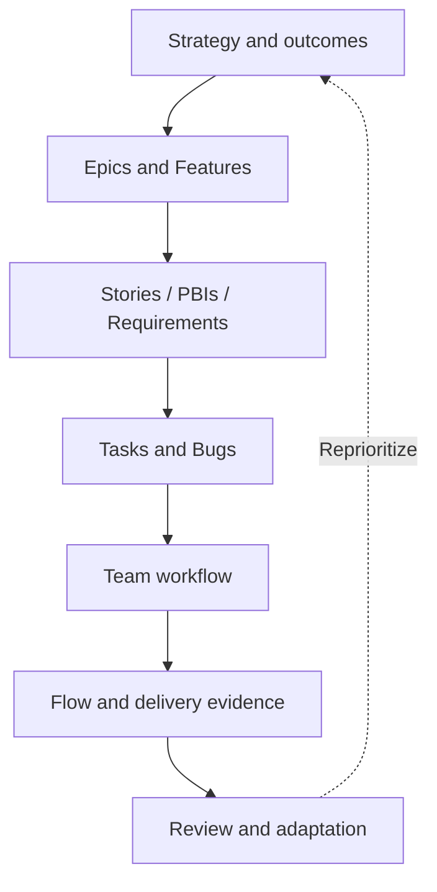

# Chapter 2 — Agile Planning with Azure Boards

[← Part I — DevOps Foundations](../README.md)

## Chapter purpose

Azure Boards turns product intent and delivery activity into a visible system of work. This chapter explains how to design that system so it supports decisions rather than merely stores tickets.

The central principle is simple: **the work-tracking model should reflect how value flows through the team.** Process names, work-item types, states, paths, boards, and metrics are useful only when people interpret them consistently.

## Learning objectives

After completing this chapter, you should be able to:

- Choose among Basic, Agile, Scrum, and CMMI processes
- Design a useful Epic–Feature–Backlog Item–Task hierarchy
- Explain Area Paths and Iteration Paths without confusing ownership and time
- Use backlogs, boards, sprints, queries, and dashboards for their intended purposes
- Define practical Ready and Done policies
- Separate capacity, estimates, velocity, and forecasts
- Interpret flow metrics and identify bottlenecks
- Link work items to each other and to delivery evidence
- Diagnose why work is missing from a team view

## Chapter model

## Topics

1. [Azure Boards Process Models](01-azure-boards-process-models.md)
2. [Work Item Types and Hierarchy](02-work-item-types-and-hierarchy.md)
3. [Area Paths and Iteration Paths](03-area-paths-and-iteration-paths.md)
4. [Backlogs, Boards, Sprints, and Queries](04-backlogs-boards-sprints-and-queries.md)
5. [Definition of Ready and Definition of Done](05-definition-of-ready-and-definition-of-done.md)
6. [Capacity, Estimation, Velocity, and Forecasting](06-capacity-estimation-velocity-and-forecasting.md)
7. [Flow Metrics and Dashboards](07-flow-metrics-and-dashboards.md)
8. [Work Item Links and Traceability](08-work-item-links-and-traceability.md)

## Running case study

Use a fictional online store throughout the chapter:

- **Outcome:** reduce checkout abandonment
- **Epic:** Checkout Experience Modernization
- **Feature:** Guest Checkout
- **User Story:** As a first-time shopper, I can purchase without creating an account
- **Tasks:** API, UI, automated tests, telemetry, documentation
- **Bug:** Address validation rejects valid apartment numbers

Model the case in a learning project, then compare it with a sanitized example from your current project.

## Practical chapter lab

1. Create a project using an intentionally chosen process.
2. Configure one delivery team and one portfolio view.
3. Define Area Paths for meaningful ownership.
4. Define three Iteration Paths.
5. Create the case-study hierarchy.
6. Add acceptance criteria, value, risk, and links.
7. Configure board columns and WIP limits.
8. Plan a sprint using capacity and historical evidence.
9. Create shared queries for blocked, stale, unparented, and unassigned work.
10. Build a dashboard for outcome, flow, quality, and delivery.
11. Link a work item to a branch, pull request, build, and deployment.
12. Review what the model encourages and what it might distort.

## Common chapter misconceptions

| Misconception | Better understanding |
|---|---|
| Area Path identifies the sprint | Area Path represents product/team ownership or classification; Iteration Path represents time |
| Every story needs many tasks | Tasks are useful when they improve planning, coordination, or visibility |
| Velocity measures productivity | Velocity is a local planning signal influenced by estimation and capacity |
| A dashboard should show every available chart | A dashboard should support a specific audience and decision |
| Ready and Done are Azure DevOps states | They are team policies; states may represent them but do not create quality |
| More hierarchy means better planning | Excess hierarchy increases maintenance and delays feedback |
| Linking everything as Related provides traceability | Specific link types communicate meaning and support useful navigation |

## Chapter completion

- [ ] Select and justify a process
- [ ] Build a coherent work-item hierarchy
- [ ] Configure Area and Iteration Paths
- [ ] Explain the purpose of every main Boards view
- [ ] Define Ready and Done policies
- [ ] Plan with capacity without treating estimates as commitments
- [ ] Interpret a cumulative flow diagram
- [ ] Build a decision-oriented dashboard
- [ ] Demonstrate work-to-delivery traceability
- [ ] Complete the case-study lab
