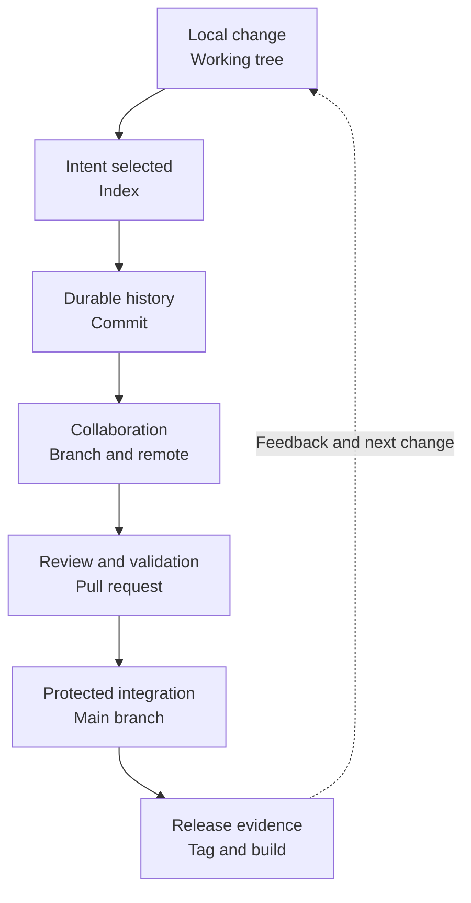

# Part II — Source Control and Collaboration

[← Complete curriculum](../README.md)

## Why this Part matters

Source control is the evidence system for software change. Git records what changed and how histories relate; Azure Repos adds shared hosting, review, policy, identity, permissions, and traceability. Together they create the collaboration boundary through which most production changes should pass.

Knowing a few Git commands is not enough. An expert must understand the Git data model, select safe history operations, recover lost work, design a branching strategy, configure meaningful pull-request controls, and balance delivery speed with protection.

## What you will learn

### Chapter 3 — Git Fundamentals

You will learn:

- How the working tree, index, local repository, and remotes relate
- How Git represents commits, trees, branches, tags, and HEAD
- What clone, fetch, pull, and push actually change
- When to merge or rebase and how each shapes history
- How to diagnose and resolve conflicts safely
- How reset, restore, revert, and cherry-pick differ
- How atomic commits, messages, and ignore rules improve collaboration
- How tags and semantic versioning support releases

[Open Chapter 3 →](chapter-03-git-fundamentals/README.md)

### Chapter 4 — Azure Repos and Enterprise Branching Strategies

You will learn:

- How trunk-based development and GitFlow differ
- How to design the pull-request lifecycle
- How branch policies and build validation protect critical branches
- How reviewer, status-check, and comment-resolution policies work
- How Azure Repos merge strategies affect history
- How repository and branch permissions inherit and override
- When to use a monorepo, multiple repositories, branches, or forks
- How to manage hotfixes, emergency changes, release branches, and large files

[Open Chapter 4 →](chapter-04-azure-repos-and-enterprise-branching/README.md)

## Part learning map

## How this Part will help you

### In daily engineering

You will be able to explain local and remote state, synchronize safely, prepare reviewable changes, resolve conflicts, recover from common mistakes, and understand what a pull request will do before completing it.

### In repository administration

You will be able to protect important branches, use groups and inheritance, restrict bypass and force-push permissions, select merge strategies, and design emergency access that is controlled and auditable.

### In architecture

You will be able to choose a repository model, branching strategy, release method, and binary-storage approach based on coupling, ownership, risk, and delivery cadence.

### In interviews and teaching

You will be able to draw the Git state model, explain merge versus rebase, distinguish revert from reset, justify branch policies, and troubleshoot real repository scenarios.

## Safety principles

- Inspect state before changing it
- Prefer additive recovery on shared history
- Rewrite only history that has not been shared, unless a coordinated recovery explicitly requires it
- Protect critical branches with pull requests and policies
- Give bypass and force-push permissions only for documented exceptional use
- Never commit credentials, private keys, or production secrets
- Keep generated output and dependencies out of source history
- Rehearse destructive maintenance in a disposable clone
- Preserve audit evidence for emergency changes

## Part project

Create and administer a learning repository:

1. Initialize or clone the repository.
2. Add source, documentation, tests, and ignore rules.
3. Create several small commits.
4. Create and update a feature branch.
5. Produce and resolve a conflict.
6. Demonstrate merge and rebase in disposable branches.
7. Undo a local mistake and revert a shared change.
8. Push to Azure Repos.
9. Protect main with pull-request policies.
10. Create and review a pull request.
11. Exercise each allowed merge strategy in a disposable repository.
12. Tag a release.
13. Simulate and document a hotfix.
14. Audit repository and branch permissions.
15. Write a repository working agreement.

## Definition of completion

- [ ] Draw the Git state model from memory
- [ ] Explain which objects a commit references
- [ ] Predict the result of fetch, pull, push, merge, and rebase
- [ ] Resolve a conflict without discarding valid changes
- [ ] Choose the correct undo or recovery command
- [ ] Write atomic commits and useful messages
- [ ] Design a branching and release strategy
- [ ] Configure and justify branch policies
- [ ] Explain effective repository and branch permissions
- [ ] Choose between monorepo, multiple repositories, and forks
- [ ] Demonstrate a controlled hotfix
- [ ] Present the Part project

## Chapters

- [Chapter 3 — Git Fundamentals](chapter-03-git-fundamentals/README.md)
- [Chapter 4 — Azure Repos and Enterprise Branching Strategies](chapter-04-azure-repos-and-enterprise-branching/README.md)

## Authoritative references

- [Git reference documentation](https://git-scm.com/docs)
- [Azure Repos Git documentation](https://learn.microsoft.com/en-us/azure/devops/repos/git/)
- [Azure Repos branching guidance](https://learn.microsoft.com/en-us/azure/devops/repos/git/git-branching-guidance)
- [Secure repositories and pull requests](https://learn.microsoft.com/en-us/azure/devops/repos/git/secure-repositories-pull-requests)
