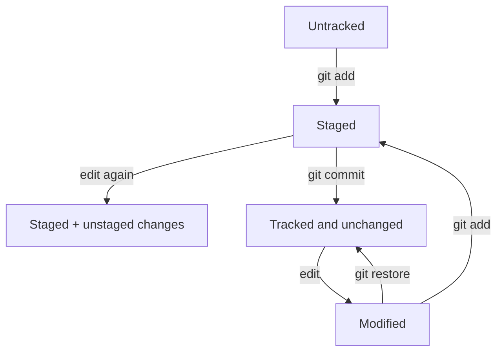

# Git Working Tree, Index, and Repository

> Chapter 3 — Git Fundamentals

[Chapter home](README.md) · [Next →](02-commits-branches-tags-and-head.md)

## Purpose

Git uses several local states. Understanding them prevents accidental commits, discarded work, and false assumptions about what has been shared.

## The four important locations

| Location | Meaning | Typical inspection |
|---|---|---|
| Working tree | Checked-out files you edit | git status, git diff |
| Index or staging area | Proposed content for the next commit | git diff --staged |
| Local repository | Commit objects and references in .git | git log, git show |
| Remote repository | Shared objects and references | git remote, git fetch |

The index is not a list of filenames. It represents the exact snapshot Git will use for the next commit. A file can therefore contain both staged and unstaged changes.

## State transitions



## Essential inspection commands

```bash
git status
git status --short
git diff
git diff --staged
git diff HEAD
```

- git diff shows unstaged changes relative to the index.
- git diff --staged shows what the next commit would add relative to HEAD.
- git diff HEAD shows all working-tree and staged differences from the current commit.

Read status before and after every staging or recovery operation.

## Intentional staging

Avoid staging everything automatically when unrelated work is present. Useful patterns include:

```bash
git add path/to/file
git add -p
git restore --staged path/to/file
```

Patch staging lets you select coherent hunks. It is valuable when one file contains more than one logical change.

## Repository metadata

The .git directory contains objects, references, configuration, index state, and logs. Do not edit it casually. The working tree can be recreated from committed content; the .git directory is the repository's local history and metadata.

A bare repository has no normal working tree and is commonly used as a server-side repository. A standard developer clone has both the .git repository and checked-out files.

## Ignored, untracked, and tracked

- **Untracked:** Git sees the file but it is not in the index or a commit.
- **Ignored:** an ignore pattern tells normal Git status and add operations not to select it.
- **Tracked:** the path exists in Git history/index. Adding it to .gitignore later does not stop tracking it.

Never use ignore rules as secret protection. If a secret was committed, remove and rotate the credential; ignoring the file does not erase history.

## Practical exercise

1. Create two files and run status.
2. Stage one file.
3. Modify the staged file again.
4. Compare git diff and git diff --staged.
5. Use patch staging to select one hunk.
6. Unstage it without discarding the file.
7. Commit only the intended snapshot.
8. Verify the working tree still contains the excluded change.

## Common mistakes

- Running commit without reviewing staged content
- Believing all edits in a staged file are staged
- Using add indiscriminately around secrets or generated files
- Confusing unstage with discard
- Editing files inside .git
- Assuming ignored files cannot be exposed
- Deleting the working directory before confirming commits were pushed

## Interview preparation

**Q: What is the Git index?**  
It is the staged snapshot Git will use to construct the next commit. It sits conceptually between the working tree and the local repository.

**Q: Can one file have staged and unstaged changes?**  
Yes. Stage content, then edit the file again, or stage selected hunks.

**Q: What does git add do?**  
It writes selected content to the index. It does not create a commit or send data to a remote.

**Q: Why inspect git diff --staged?**  
It shows the exact change proposed for the next commit and helps detect missing, unrelated, or sensitive content.

## Quick reference

| Goal | Command |
|---|---|
| Inspect state | git status |
| Inspect unstaged changes | git diff |
| Inspect staged changes | git diff --staged |
| Stage a path | git add path |
| Stage selected hunks | git add -p |
| Unstage safely | git restore --staged path |
| Discard an unstaged path | git restore path |

## Further reading

- [Git documentation](https://git-scm.com/docs)
- [Azure Repos Git documentation](https://learn.microsoft.com/en-us/azure/devops/repos/git/)
