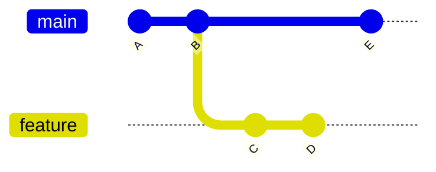

# Commits, Branches, Tags, and HEAD

> Chapter 3 — Git Fundamentals

[← Previous](01-git-working-tree-index-and-repository.md) · [Chapter home](README.md) · [Next →](03-clone-fetch-pull-and-push.md)

## Purpose

Git history is a graph of immutable objects. Branches and tags are references into that graph. This model explains branching speed, detached HEAD, merge parents, history rewriting, and recovery.

## Git objects

### Blob

Stores file content. The filename is represented by a tree entry, not by the blob itself.

### Tree

Represents a directory snapshot by mapping names to blobs and other trees.

### Commit

References a root tree, parent commit or commits, author and committer metadata, and a message. A root commit has no parent; a normal commit usually has one; a merge commit has multiple parents.

### Tag object

An annotated tag can store a tagger, date, message, and reference to another object, commonly a commit.

Git identifies objects by hashes derived from their content and metadata. Changing history creates different object identities.

## References

A reference is a human-readable name pointing to an object.

- Local branch: refs/heads/main
- Remote-tracking branch: refs/remotes/origin/main
- Tag: refs/tags/v1.0.0

A branch is a movable reference. Creating a commit while on a branch moves that branch reference to the new commit.

## HEAD

HEAD identifies the current checkout. Usually it symbolically refers to a branch. In detached HEAD state, it points directly to a commit.

Detached HEAD is useful for inspection and experimentation, but commits created there are not automatically retained by a named branch.

Recovery:

```bash
git switch -c recovery/my-work
```

Create the branch before leaving the detached commits, or find them later through reflog if still available.

## Commit graph example



main points to E; feature points to D. Both histories share A and B.

## Lightweight and annotated tags

- Lightweight tag: a name directly referencing an object.
- Annotated tag: a tag object with metadata and a message; it can also be cryptographically signed using supported Git signing workflows.

Prefer annotated tags for formal releases because they carry intent and metadata. A tag is normally expected not to move. Reusing a release tag for different content destroys trust.

## Useful inspection

```bash
git log --oneline --decorate --graph --all
git show <commit-or-tag>
git branch -vv
git tag --list
git rev-parse HEAD
git reflog
```

## Author versus committer

The author records who originally wrote the change; the committer records who created this commit object. Rebasing can preserve authorship while changing committer metadata and commit identities.

## Common mistakes

- Saying a branch “contains” files rather than points to history
- Confusing origin/main with a live remote branch
- Moving published tags
- Committing in detached HEAD and switching away without naming the work
- Treating a short hash as globally permanent outside its repository context
- Assuming identical file content means identical commit identity
- Changing system time or identity settings without understanding audit implications

## Interview preparation

**Q: What is a branch?**  
A movable reference to a commit. New commits advance the current branch reference.

**Q: What is HEAD?**  
The reference describing the current checkout, normally a symbolic reference to a branch, or directly to a commit in detached state.

**Q: Why does rebase change commit IDs?**  
Rebase creates new commit objects with different parent relationships and committer metadata, so their hashes differ.

**Q: Lightweight versus annotated tag?**  
A lightweight tag is a direct reference. An annotated tag is a separate object with tagger metadata and a message, making it preferable for formal releases.

## Practical exercise

Create two branches, diverge them, draw the graph, and identify HEAD, each branch reference, and a remote-tracking reference. Check out an old commit, create work in detached HEAD, then retain it by creating a branch.

## Further reading

- [Git revisions](https://git-scm.com/docs/gitrevisions)
- [git-commit](https://git-scm.com/docs/git-commit)
- [git-tag](https://git-scm.com/docs/git-tag)
