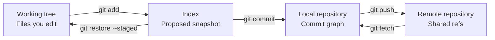

# Chapter 3 — Git Fundamentals

[← Part II — Source Control and Collaboration](../README.md)

## Chapter purpose

Git is a distributed content-addressed version-control system. Most confusion disappears once its state model is understood: files exist in a working tree, selected changes are represented in the index, commits form an immutable graph in the local repository, and remotes exchange objects and references.

This chapter teaches that model first, then applies it to normal collaboration, safe history integration, conflict resolution, undo operations, commit design, and release tagging.

## Learning objectives

After completing this chapter, you should be able to:

- Explain the working tree, index, repository, and remote
- Interpret status, diff, log, and branch information
- Explain commits, trees, blobs, references, tags, and HEAD
- Predict how clone, fetch, pull, and push affect local and remote state
- Choose between merge and rebase
- Resolve conflicts by understanding intended behavior
- Select reset, restore, revert, or cherry-pick safely
- Design atomic commits and ignore rules
- Apply tags and semantic versioning responsibly
- Recover common forms of apparently lost work

## Git state model



## Topics

1. [Git Working Tree, Index, and Repository](01-git-working-tree-index-and-repository.md)
2. [Commits, Branches, Tags, and HEAD](02-commits-branches-tags-and-head.md)
3. [Clone, Fetch, Pull, and Push](03-clone-fetch-pull-and-push.md)
4. [Merge, Rebase, and History](04-merge-rebase-and-history.md)
5. [Merge Conflict Resolution](05-merge-conflict-resolution.md)
6. [Reset, Restore, Revert, and Cherry-pick](06-reset-restore-revert-and-cherry-pick.md)
7. [Atomic Commits and Ignore Rules](07-atomic-commits-and-ignore-rules.md)
8. [Tagging and Semantic Versioning](08-tagging-and-semantic-versioning.md)

## Practical chapter lab

Use a disposable repository and record the commit graph after each step:

1. Initialize the repository and create three files.
2. Modify all three but stage only selected hunks.
3. Create two atomic commits.
4. Create a feature branch and diverge it from main.
5. Integrate main with a merge.
6. Repeat the scenario with rebase.
7. Create and resolve a conflict.
8. Restore an uncommitted file.
9. Unstage a file without discarding its content.
10. Reset an unshared commit.
11. Revert a shared commit.
12. Cherry-pick one isolated fix.
13. Recover a commit using reflog.
14. Create an annotated release tag.
15. Push branches and tags to a learning remote.

## Diagnostic routine

Before any unfamiliar Git operation, collect evidence:

```bash
git status
git branch --show-current
git log --oneline --decorate --graph --all -n 20
git diff
git diff --staged
git remote -v
```

Then state, in plain language, which working-tree files, index entries, commits, and references the next command will change.

## Common chapter misconceptions

| Misconception | Better understanding |
|---|---|
| A branch contains commits | A branch is a movable reference to a commit |
| git add sends changes to the server | It updates the local index |
| git pull only downloads | It fetches and then integrates |
| Rebase removes commits | It creates new commits with new identities |
| Reset and revert are interchangeable | Reset moves references; revert adds an inverse commit |
| A merge conflict means Git is broken | Git needs human intent where automatic combination is unsafe |
| A deleted branch means commits are immediately erased | Unreferenced commits may remain recoverable for a period |

## Chapter completion

- [ ] Complete the disposable-repository lab
- [ ] Draw a commit graph for merge and rebase
- [ ] Explain origin/main versus local main
- [ ] Resolve content and structural conflicts
- [ ] Demonstrate safe local and shared-history undo
- [ ] Recover a detached or lost commit
- [ ] Create a release tag and verify its target
- [ ] Answer every topic's interview questions
