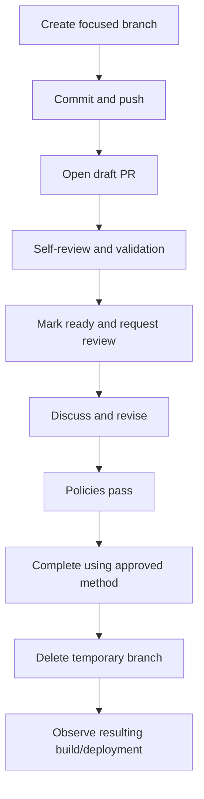

# Pull Request Lifecycle

> Chapter 4 — Azure Repos and Enterprise Branching Strategies

[← Previous](01-trunk-based-development-and-gitflow.md) · [Chapter home](README.md) · [Next →](03-branch-policies-and-build-validation.md)

## Purpose

A pull request is a proposal to integrate one branch into another. It creates a durable space for context, automated evidence, discussion, review, policy evaluation, and controlled completion.

A PR is not merely a permission form. Its value is the quality of the decision it enables.

## Lifecycle

## Before opening

- Rebase or merge the current target according to team policy
- Run relevant local checks
- Remove unrelated files and debug output
- Review the diff
- Link the work item
- Confirm no secrets or sensitive data appear
- Push a comprehensible commit series

## PR description

A useful description includes:

- Problem and desired outcome
- Scope and important exclusions
- Implementation approach
- Risk and affected components
- Test evidence
- Deployment/configuration/database implications
- Rollback or mitigation notes where relevant
- Screenshots or API examples when useful
- Linked work and dependencies
- Follow-up work

Do not make reviewers reconstruct intent from the diff.

## Draft pull requests

Use drafts for early collaboration, architecture feedback, or visible work in progress. Do not rely on reviewers to repeatedly inspect unstable changes without clear questions.

## Author responsibilities

- Keep the PR focused and reasonably small
- Perform self-review
- Explain non-obvious choices
- Respond constructively
- Update tests and documentation
- Resolve or explicitly disposition comments
- Notify reviewers after significant revisions
- Avoid rewriting reviewed commits without making the change visible

## Reviewer responsibilities

- Understand intent and acceptance criteria
- Review behavior, correctness, maintainability, security, operations, and tests
- Distinguish blocking issues from suggestions
- Give specific, respectful feedback
- Recheck material revisions
- Avoid approving changes not understood
- Share knowledge rather than merely enforce style

Azure Repos reviewer votes include Approve, Approve with suggestions, Wait for author, Reject, and Reset feedback. A vote is not the same as completing the PR.

## Completion

Before completion:

- Policies and validation are current
- Required comments are resolved
- Target has not changed in a way that invalidates review
- Merge method is appropriate
- Work-item transition and branch deletion options are deliberate
- The resulting pipeline and deployment will be monitored

Completion can be immediate when policies pass or configured through supported auto-complete behavior. Use completion options consistently.

## Abandon and revert

Abandon a proposal that should not merge; its history and discussion remain useful. If a completed PR must be undone, create a revert change and run it through the appropriate review and validation instead of erasing history.

## PR size

Smaller PRs reduce review delay and defects, but “small” depends on context. Separate mechanical refactoring from behavior where possible. Avoid splitting a cohesive invariant across PRs in a way that temporarily breaks the system.

## Common mistakes

- Empty descriptions
- Mixing refactor, dependency updates, formatting, and features
- Approving based only on pipeline success
- Treating reviewer count as review quality
- Resolving comments without addressing them
- Large changes after approval without re-review
- Using PRs to compensate for unclear ownership
- Leaving merged branches and stale PRs indefinitely

## Interview preparation

**Q: What makes a good pull request?**  
A focused, well-explained change linked to intent, with appropriate tests, risk context, reviewable size, current validation, constructive discussion, and controlled completion.

**Q: Author versus reviewer responsibility?**  
The author prepares evidence and clarity; reviewers independently evaluate the proposed integration. Both share responsibility for outcome, but approval must represent genuine review.

**Q: When should a PR be re-reviewed?**  
After material source changes, conflict resolution, target changes affecting behavior, or failed validation that required substantive correction.

**Q: Draft PR use?**  
For early visibility and targeted feedback before the change is ready for approval. It should not create review fatigue.

## Practical exercise

Create a PR template, then open one strong and one intentionally poor PR. Compare review time, number of clarification comments, policy results, and traceability.

## Further reading

- [About pull requests](https://learn.microsoft.com/en-us/azure/devops/repos/git/about-pull-requests)
- [Review pull requests](https://learn.microsoft.com/en-us/azure/devops/repos/git/review-pull-requests)
- [Complete, abandon, or revert pull requests](https://learn.microsoft.com/en-us/azure/devops/repos/git/complete-pull-requests)
