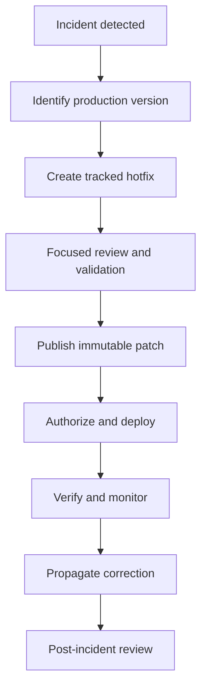

# Hotfixes, Emergency Changes, and Git LFS

> Chapter 4 — Azure Repos and Enterprise Branching Strategies

[← Previous](07-monorepo-versus-multiple-repositories.md) · [Chapter home](README.md)

## Purpose

This topic addresses two exceptional pressures on repository governance:

1. An urgent production change that cannot follow normal timing.
2. Large binary content that normal Git storage handles poorly.

Neither should lead to abandoning traceability or repository health.

## Hotfix and emergency changes

## Hotfix principles

A hotfix is a small, targeted correction for a released system. It should still preserve:

- Incident or work-item record
- Clear source base
- Independent review where feasible
- Focused validation
- Immutable artifact
- Deployment authorization
- Monitoring
- Propagation to other maintained branches
- Post-change review

Urgency changes timing and scope, not the need for evidence.

## Choosing the source line

For a single continuously deployed mainline, create a hotfix branch from the production-equivalent commit or current main only after confirming they correspond.

For multiple supported releases:

1. Identify the affected release branch/tag.
2. Develop and validate the narrow fix.
3. Publish a new patch version.
4. Apply the correction to main first where feasible, then port it to release branches; or reconcile main immediately after a release-line-first emergency.
5. Verify every maintained line.

Avoid a fix that exists only in production history and is later reintroduced as a regression.

## Emergency bypass

If policy bypass is required:

- Restrict it to a small group
- Record the reason and authorizer
- Use the least powerful bypass mechanism
- Preserve logs and exact commit identity
- Perform validation that time and conditions allow
- Review immediately after stabilization
- Reapply normal controls to follow-up work
- Measure and reduce repeated bypass causes

An emergency account should not be a permanently shared credential.

## Hotfix flow



## Large files and Git LFS

## Storage decision

| Content | Preferred location |
|---|---|
| Source, scripts, small text configuration | Git |
| Reusable dependencies and packages | Azure Artifacts or package manager |
| Build outputs and test artifacts | Pipeline/artifact storage |
| Large binary source assets that change | Git LFS |
| Secrets | Approved secret store, never Git |

Normal Git history retains large blobs even after a file is deleted in a later commit. Frequently changing binaries increase clone, fetch, and storage cost because they do not diff efficiently.

## Git LFS model

Git LFS stores a small pointer file in Git and the large content in separate LFS storage. Clients need Git LFS support to retrieve the content.

Typical setup:

```bash
git lfs install
git lfs track "*.psd"
git add .gitattributes
git add path/to/asset.psd
git commit -m "Track design asset with Git LFS"
```

Commit .gitattributes before or with LFS-managed files. Verify pipeline agents can retrieve LFS content when needed.

## LFS limitations

- Every relevant client and agent needs support
- Binary merges remain difficult
- File locking may require team process
- Repository import may transfer LFS pointers but not underlying LFS objects
- Web upload can bypass the expected LFS workflow in some scenarios
- Moving existing large history requires specialized, disruptive rewriting

Use Azure Repos maximum-file-size policy to prevent new oversized blobs. Rehearse history cleanup in a clone, coordinate downtime or force updates, and retain backups.

## Common mistakes

- Direct push to production branch with no record
- Emergency fix never propagated to main
- Reusing the same release tag after a fix
- Broad permanent bypass rights
- Committing dependencies or build outputs
- Adding large files to LFS only after normal Git history already contains them
- Importing LFS pointers without migrating objects
- Assuming .gitignore removes large history
- Rewriting shared history without a migration plan

## Interview preparation

**Q: How do you handle an emergency change?**  
Use an explicit emergency workflow: tracked intent, least privilege, focused review and validation, immutable artifact, authorization, monitoring, evidence, propagation, and post-incident review.

**Q: Why apply a hotfix back to main?**  
Otherwise later releases can reintroduce the defect because the canonical development line never received the correction.

**Q: Git LFS versus Azure Artifacts?**  
Git LFS is for large binary source assets that belong in the version-control workflow. Azure Artifacts is for versioned reusable packages and dependencies.

**Q: Does deleting a large committed file reduce repository history size?**  
No. The blob remains in earlier history. Removing it requires history rewriting or repository migration with careful coordination.

## Practical exercise

Simulate a production defect on a tagged release, create a patch, validate it, tag a new patch version, and propagate it to main. Then configure LFS for a sample binary and a repository file-size policy. Document recovery if a large blob is accidentally committed.

## Further reading

- [Azure Repos branching guidance](https://learn.microsoft.com/en-us/azure/devops/repos/git/git-branching-guidance)
- [Work with large files](https://learn.microsoft.com/azure/devops/repos/git/manage-large-files)
- [Azure Repos Git limits](https://learn.microsoft.com/en-us/azure/devops/repos/git/limits)
- [Repository settings and file-size policy](https://learn.microsoft.com/en-us/azure/devops/repos/git/repository-settings)
