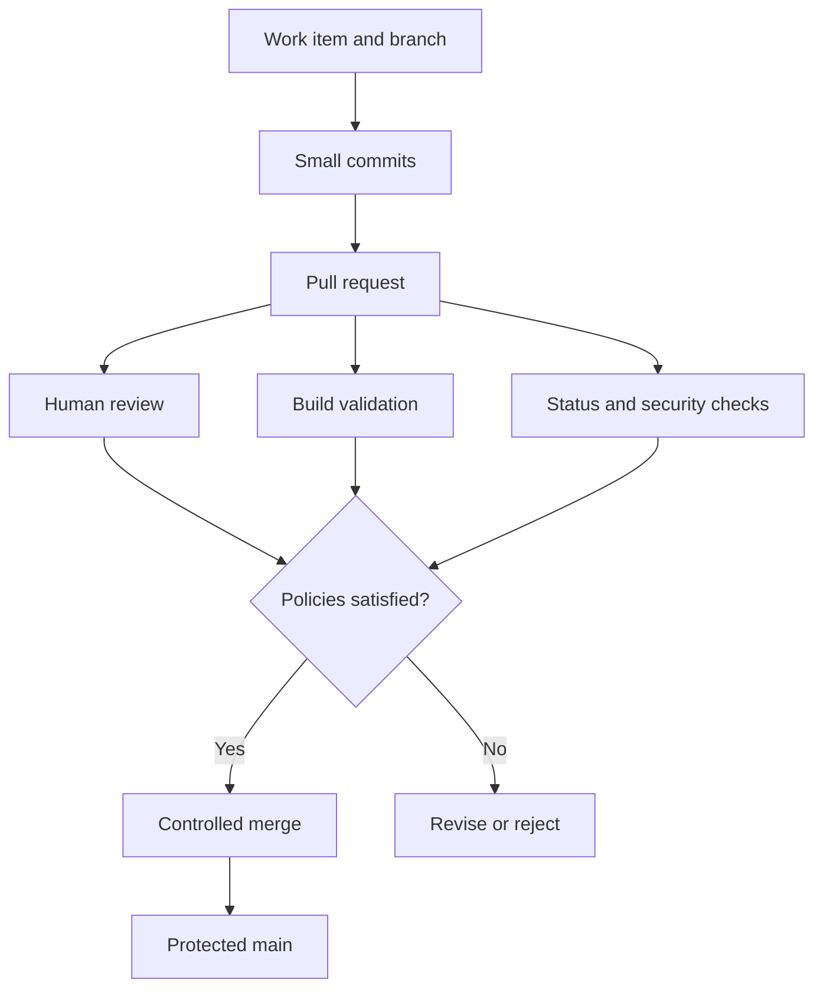

# Chapter 4 — Azure Repos and Enterprise Branching Strategies

[← Part II — Source Control and Collaboration](../README.md)

## Chapter purpose

Azure Repos turns Git history into a governed team workflow. Pull requests create a review and discussion boundary; policies validate proposed changes; permissions control authority; and branching and repository models shape delivery speed, auditability, and maintenance.

This chapter focuses on judgment. More branches, reviewers, and policies do not automatically improve safety. Strong controls protect important risks while preserving small changes, fast feedback, and clear ownership.

## Learning objectives

After completing this chapter, you should be able to:

- Compare trunk-based development and GitFlow
- Design a complete pull-request lifecycle
- Configure branch policies and build validation
- Distinguish reviewers, status checks, and comment resolution
- Choose an Azure Repos merge strategy
- Calculate effective repository and branch permissions
- Choose monorepo, multiple repositories, or forks
- Design controlled release, hotfix, and emergency workflows
- Store source, dependencies, artifacts, and large binaries appropriately
- Audit repository governance without blocking normal development

## Protected-change model

## Topics

1. [Trunk-Based Development and GitFlow](01-trunk-based-development-and-gitflow.md)
2. [Pull Request Lifecycle](02-pull-request-lifecycle.md)
3. [Branch Policies and Build Validation](03-branch-policies-and-build-validation.md)
4. [Reviewers, Status Checks, and Comment Resolution](04-reviewers-status-checks-and-comment-resolution.md)
5. [Merge Strategies](05-merge-strategies.md)
6. [Repository and Branch Permissions](06-repository-and-branch-permissions.md)
7. [Monorepo versus Multiple Repositories](07-monorepo-versus-multiple-repositories.md)
8. [Hotfixes, Emergency Changes, and Git LFS](08-hotfixes-emergency-changes-and-git-lfs.md)

## Practical chapter lab

In a learning Azure Repos repository:

1. Document the chosen branch strategy.
2. Create naming conventions and branch folders.
3. Protect main with pull requests.
4. Require reviewers, linked work items, resolved comments, and build validation.
5. Add path-based reviewers for a sensitive directory.
6. Configure one status check or equivalent validation.
7. Limit allowed merge methods.
8. Test policy behavior with a pull request.
9. Inspect repository and branch permissions.
10. Test an authorized bypass only in a disposable branch if available.
11. Exercise a hotfix from detection to corrected release.
12. Add a maximum-file-size policy.
13. Decide where source, packages, build outputs, and large binary assets belong.
14. Produce a repository working agreement and administrator runbook.

## Governance principles

- Protect durable, high-value branches—not every temporary branch
- Assign permissions to groups rather than individuals
- Prefer Not set over Deny unless an explicit override is required
- Keep bypass and force-push rights rare and auditable
- Make PR validation fast enough to encourage small changes
- Require human judgment where automation cannot assess intent
- Revalidate when source or target changes materially
- Preserve an emergency path, but make its use visible and reviewable
- Review policies periodically as architecture and risk change

## Chapter completion

- [ ] Defend a branch strategy using context and tradeoffs
- [ ] Create and review a high-quality pull request
- [ ] Configure a balanced policy set
- [ ] Explain every Azure Repos merge method
- [ ] Trace effective repository and branch permissions
- [ ] Select a repository architecture
- [ ] Execute and document a hotfix
- [ ] Explain Git, Azure Artifacts, pipeline artifacts, and Git LFS placement
- [ ] Complete the chapter lab
