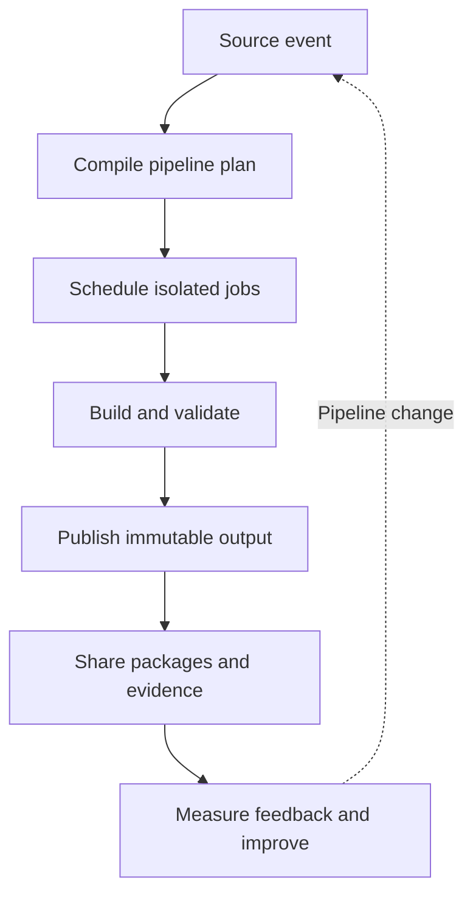

# Part III — Continuous Integration with Azure Pipelines

[← Complete curriculum](../README.md)

## Why this Part matters

A pipeline is executable delivery policy. It converts source into evidence and immutable outputs through a repeatable process. A strong continuous-integration system detects defects quickly, protects trust boundaries, produces traceable artifacts, and gives developers clear feedback. A weak pipeline can be green while producing the wrong artifact, skipping important tests, leaking secrets, or hiding non-determinism.

Part III develops both pipeline authoring and pipeline engineering: how Azure Pipelines evaluates YAML, schedules jobs, handles data, shares reusable logic, and manages artifacts and packages at scale.

## Chapters

### Chapter 5 — YAML Pipeline Fundamentals

Learn the execution hierarchy, triggers, stages, jobs, steps, tasks, agents, variables, parameters, expressions, conditions, dependencies, artifacts, logs, and run controls.

[Open Chapter 5 →](chapter-05-yaml-pipeline-fundamentals/README.md)

### Chapter 6 — Continuous Integration Design

Learn build-once principles, reproducibility, PR validation, test strategy, quality gates, caching, parallelism, coverage, analysis, versioning, containers, provenance, and retention.

[Open Chapter 6 →](chapter-06-continuous-integration-design/README.md)

### Chapter 7 — Reusable Pipelines and YAML Templates

Learn step, job, stage, and variable templates; typed parameters; compile-time insertion; central template repositories; versioning; required-template enforcement; and governance design.

[Open Chapter 7 →](chapter-07-reusable-pipelines-and-yaml-templates/README.md)

### Chapter 8 — Artifacts and Dependency Management

Learn pipeline artifacts, Azure Artifacts feeds, package ecosystems, scope, permissions, upstream sources, immutability, semantic versions, lock files, promotion, retention, and supply-chain risk.

[Open Chapter 8 →](chapter-08-artifacts-and-dependency-management/README.md)

## Part learning map

## Outcomes

After completing this Part, you should be able to:

- Explain how Azure Pipelines compiles and runs YAML
- Select triggers and scopes deliberately
- Design secure hosted or self-hosted execution
- Use parameters, variables, expressions, and output data correctly
- Build fast, deterministic, evidence-rich CI
- Refactor pipelines into stable reusable templates
- Govern templates without preventing team autonomy
- Publish and consume immutable artifacts and packages
- Diagnose skipped stages, empty variables, agent mismatches, stale caches, and feed permissions
- Defend artifact retention and dependency strategies

## Part project

Build a production-style CI platform for two sample applications:

1. Create PR and main-branch validation paths.
2. Run builds on suitable agents.
3. Compile, test, analyze, and publish results.
4. Generate a unique version.
5. Produce one immutable application artifact or image.
6. Refactor shared behavior into templates.
7. Pin the template version from each consumer.
8. Publish a reusable package to Azure Artifacts.
9. Consume dependencies through a governed feed.
10. Demonstrate cache behavior and safe invalidation.
11. Exercise a failed test, skipped condition, missing output, and agent mismatch.
12. Document security boundaries, retention, and recovery.

## Safety principles

- Treat pipeline code from pull requests as untrusted
- Do not expose privileged secrets to untrusted validation
- Pin tools, dependencies, task versions, and templates appropriately
- Publish the exact outputs already tested
- Keep agents isolated and disposable where possible
- Use logging commands carefully; never print secrets
- Make conditions readable and test skipped paths
- Grant feeds and pipeline identities least privilege
- Preserve evidence according to operational and compliance needs
- Fail clearly rather than silently continuing with partial output

## Definition of completion

- [ ] Explain compile-time and runtime evaluation
- [ ] Draw stage, job, and step dependencies
- [ ] Choose an appropriate agent model
- [ ] Pass output safely between jobs and stages
- [ ] Build one artifact and promote it
- [ ] Publish complete test and coverage evidence
- [ ] Improve performance without weakening correctness
- [ ] Create reusable versioned templates
- [ ] Enforce a platform rule through protected resources
- [ ] Configure and secure an Azure Artifacts feed
- [ ] Complete the Part project
