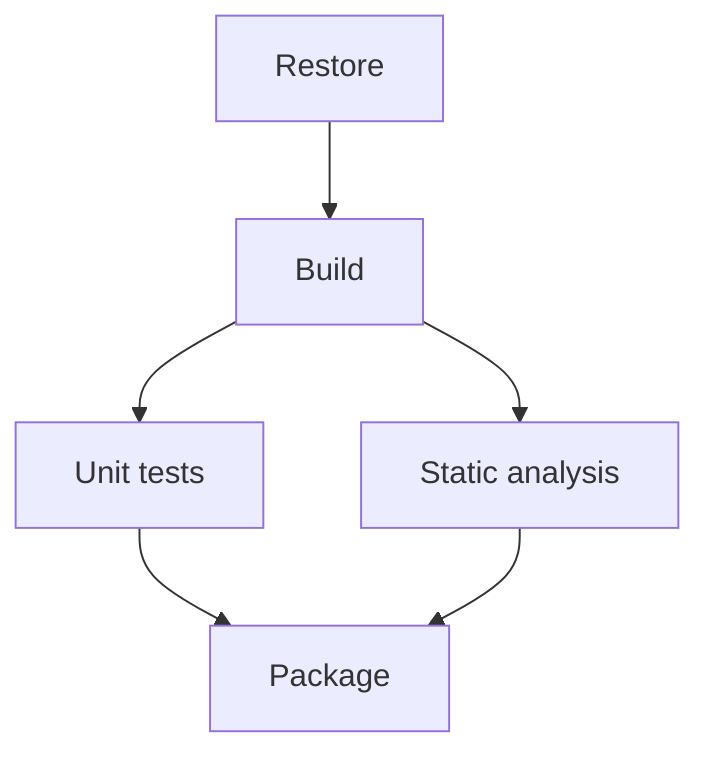

# Stages, Jobs, Steps, Tasks, and Scripts

> Chapter 5 — YAML Pipeline Fundamentals

[← Previous](02-triggers-and-pull-request-validation.md) · [Chapter home](README.md) · [Next →](04-hosted-and-self-hosted-agents.md)

## Purpose

Pipeline hierarchy defines scheduling, isolation, data movement, approvals, and failure boundaries.

## Stages

Stages represent major lifecycle boundaries such as Build, Test, Package, or Deploy. Stages run sequentially by default and can use dependsOn and conditions to form a graph.

Use stages when you need:

- Clear lifecycle status
- Separate authorization or environment checks
- Independent rerun behavior
- Cross-stage outputs
- Logical audit boundaries

Do not create a stage for every command.

## Jobs

A job is the smallest schedulable unit. Steps in a job share one execution context and workspace. Different jobs can run on different agents and should not depend on unshared local files.

Jobs in a stage run in parallel by default when they have no dependencies and capacity exists.

Job types include agent jobs, server jobs, deployment jobs, and other supported strategies. Use deployment jobs for environment deployments, not ordinary compilation.

## Steps

Steps run sequentially inside a job. They can be tasks, scripts, checkout/download/publish shortcuts, or templates. A later step can usually use files produced earlier in the same job.

## Tasks

A task is a versioned Azure Pipelines extension with defined inputs and behavior.

```yaml
steps:
- task: PublishTestResults@2
  inputs:
    testResultsFormat: JUnit
    testResultsFiles: "**/TEST-*.xml"
```

Pin the major task version and review task provenance. Marketplace tasks add supply-chain and lifecycle dependencies.

## Scripts

Scripts offer direct control and portability to local execution.

```yaml
steps:
- bash: |
    set -euo pipefail
    ./scripts/validate.sh
  displayName: Validate
```

Use repository scripts for substantial logic so they can be tested locally. Keep YAML focused on orchestration.

Never pass secrets as command-line arguments when logs or operating-system process data might expose them. Use environment variables or supported secret inputs and avoid echoing.

## Dependency design



Translate independent work into separate jobs only if parallelism and isolation justify setup and artifact-transfer cost.

## Failure behavior

By default:

- A step runs if prior work in its job has not failed
- A job/stage runs if dependencies succeed
- Jobs without dependencies can run concurrently
- Each job may receive a different agent
- continueOnError changes result semantics and can hide important failure

Use conditions deliberately and publish results on failure where useful.

## Common mistakes

- Assuming consecutive jobs share files
- Putting deployment approval logic in an ordinary build job
- Using a task for complex business logic that belongs in tested source scripts
- One giant job preventing parallelism and clear failure ownership
- Too many tiny jobs dominated by agent startup and artifact transfer
- continueOnError on a required quality check
- Scripts depending on an agent's current directory implicitly
- Unpinned external task extensions

## Interview preparation

**Q: Stage versus job?**  
A stage is a lifecycle grouping and dependency/check boundary. A job is the smallest schedulable execution unit assigned to an agent or server context.

**Q: Do jobs share a workspace?**  
Do not assume so. Jobs can run on different agents. Publish artifacts or outputs for explicit transfer.

**Q: Task versus script?**  
A task is a versioned Azure Pipelines component with structured inputs. A script provides direct control. Keep complex logic in repository scripts for local testing.

**Q: Why separate independent tests into jobs?**  
They can run in parallel and fail independently, but require parallel capacity and explicit sharing of build outputs.

## Practical exercise

Refactor a single-job pipeline into build, unit-test, and analysis jobs. Publish the build output once, download it in test jobs, and compare duration and failure visibility.

## Further reading

- [Jobs in Azure Pipelines](https://learn.microsoft.com/en-us/azure/devops/pipelines/process/phases)
- [Steps schema](https://learn.microsoft.com/en-us/azure/devops/pipelines/yaml-schema/steps)
