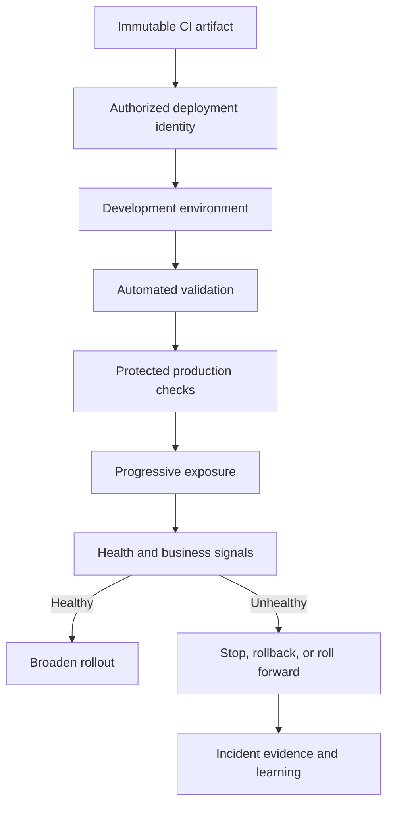

# Part IV — Continuous Delivery and Deployment

[← Complete curriculum](../README.md)

## Why this Part matters

Continuous integration proves that a change can become a release candidate. Continuous delivery proves that the same candidate can move safely through controlled environments. Continuous deployment goes one step further by automatically releasing qualified changes to production.

Part IV develops the engineering and operational judgment needed to make that movement routine: protected identities, environment history, approvals, safe configuration, progressive exposure, health-based validation, database compatibility, and rehearsed recovery. The objective is not merely to deploy—it is to reduce deployment risk and restore service quickly when reality differs from expectation.

## Chapters

### Chapter 9 — Environments and Multi-stage Deployment Pipelines

Learn CI/CD separation, environment topology, deployment jobs and history, federated service connections, variable groups, secure files, Key Vault integration, environment-specific configuration, approvals and checks, concurrency locks, and separation of duties.

[Open Chapter 9 →](chapter-09-environments-and-multi-stage-deployment/README.md)

### Chapter 10 — Deployment Strategies, Validation, and Rollback

Learn run-once, rolling, blue-green, and canary delivery; feature flags; backward-compatible database evolution; readiness, liveness, smoke tests, observability gates; rollback, roll-forward, and disaster recovery.

[Open Chapter 10 →](chapter-10-deployment-strategies-validation-and-rollback/README.md)

## Delivery trust chain

## Learning outcomes

After completing this Part, you should be able to:

- Distinguish continuous delivery from continuous deployment.
- Separate artifact production from environment deployment.
- Model Azure Pipelines environments and deployment history.
- Choose and secure service connections with least privilege.
- Store configuration and secrets in the appropriate system.
- Keep one artifact identical across all environments.
- Configure approvals, branch control, dynamic checks, business hours, and locks.
- Select a deployment strategy based on architecture, risk, and capacity.
- Decouple code deployment from feature exposure.
- Evolve databases without breaking old or new application versions.
- Design health validation and automated promotion/abort decisions.
- Choose rollback or roll-forward using explicit recovery criteria.
- Defend a separation-of-duties model without creating ceremonial bottlenecks.

## Part project

Deploy the immutable application artifact produced in Part III through Development, Test, and Production:

1. Create Azure Pipelines environments and authorize only the intended pipeline.
2. Use deployment jobs so every environment receives auditable history.
3. Authenticate with a least-privilege workload identity.
4. Externalize configuration and retrieve secrets at runtime.
5. Add automated smoke, integration, and health validation.
6. Protect Production with branch control and an approval/check policy.
7. Prevent conflicting production deployments with an exclusive lock.
8. Implement either blue-green or canary exposure.
9. Execute an expand-and-contract database change.
10. Trigger a simulated health regression and stop progression.
11. Demonstrate a rollback or roll-forward recovery.
12. Record artifact version, environment, approver/check evidence, health signals, recovery time, and lessons learned.

## Safety principles

- Promote the same immutable artifact; never rebuild per environment.
- Treat pipeline YAML, identities, agents, and protected resources as one trust boundary.
- Prefer short-lived workload identity federation over stored long-lived secrets.
- Never print, persist, or pass secrets as ordinary command-line arguments.
- Keep approvals and checks outside YAML when pipeline authors must not bypass them.
- Make health criteria measurable before starting a rollout.
- Limit blast radius before relying on rollback.
- Design database changes for overlapping application versions.
- Test recovery under realistic pressure.
- Preserve enough deployment evidence for audit and incident response.

## Definition of completion

- [ ] Explain delivery versus deployment
- [ ] Trace an artifact from CI run to production resource
- [ ] Configure protected environments and pipeline permissions
- [ ] Use a least-privilege service connection
- [ ] Separate non-secret configuration from secrets
- [ ] Apply checks and exclusive locking correctly
- [ ] Defend a rollout strategy for one real workload
- [ ] Demonstrate safe schema evolution
- [ ] Automate health-based validation
- [ ] Complete and review the Part project
