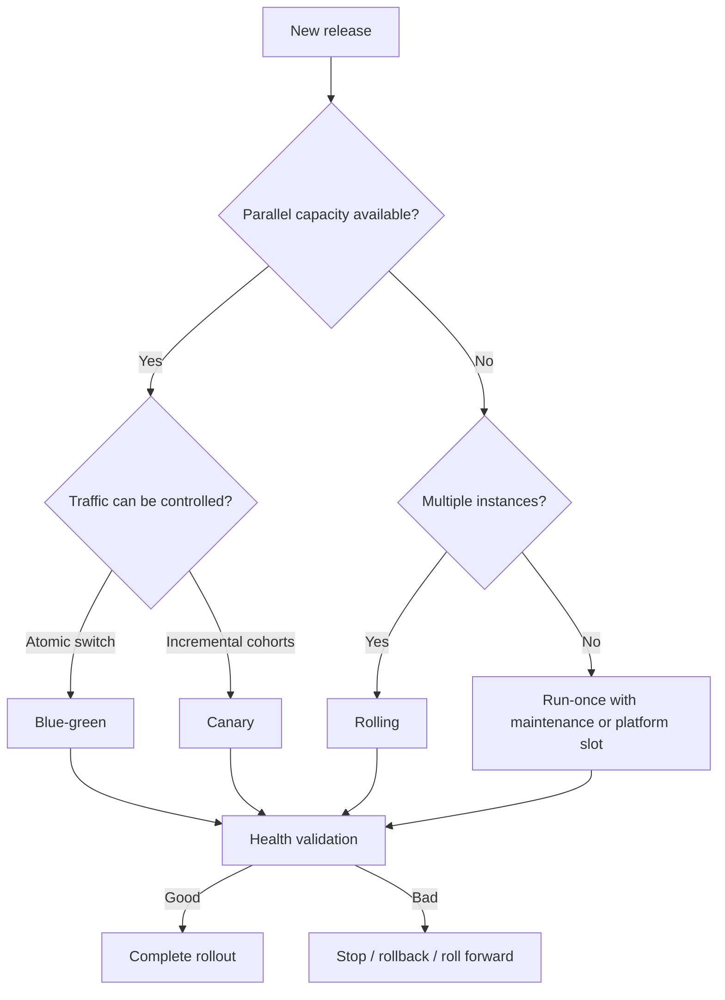

# Chapter 10 — Deployment Strategies, Validation, and Rollback

[← Part IV — Continuous Delivery and Deployment](../README.md)

This chapter turns a controlled deployment pipeline into a resilient release system. It compares rollout strategies, decouples deployment from feature exposure, handles database evolution, defines health gates, and prepares rollback or roll-forward before an incident.

## Why this chapter matters

No deployment is risk-free. Safe delivery reduces the number of users exposed before confidence grows, watches signals that represent real customer health, and stops or recovers quickly when thresholds are crossed. The correct strategy depends on architecture, capacity, state, compatibility, traffic control, and business impact—not fashion.

## Topics

| # | Topic | Practical outcome |
|---:|---|---|
| 1 | [Run-once and Rolling Deployments](01-run-once-and-rolling-deployments.md) | Select simple or batched replacement safely |
| 2 | [Blue-green Deployment](02-blue-green-deployment.md) | Switch traffic between parallel environments |
| 3 | [Canary Deployment](03-canary-deployment.md) | Increase exposure through measured increments |
| 4 | [Feature Flags](04-feature-flags.md) | Separate deployment from user exposure |
| 5 | [Backward-compatible Database Migrations](05-backward-compatible-database-migrations.md) | Evolve state across overlapping versions |
| 6 | [Health Checks and Zero Downtime](06-health-checks-and-zero-downtime.md) | Validate readiness and customer health |
| 7 | [Rollback, Roll-forward, and Recovery](07-rollback-roll-forward-and-recovery.md) | Restore service through a rehearsed decision model |

## Strategy selection map

Feature flags can complement any strategy. They control behavior exposure, not binary deployment.

## Guided chapter lab

Using a sandbox workload:

1. Deploy one immutable artifact with a run-once job.
2. Implement either rolling batches or two parallel slots.
3. Add readiness, liveness, startup, and functional smoke endpoints.
4. Route a small cohort to the new version.
5. Evaluate latency, error rate, saturation, and a business metric.
6. Pause and automatically abort when a threshold is breached.
7. Introduce a feature flag with owner and expiry.
8. Apply an expand-and-contract schema change across two versions.
9. Practice both traffic rollback and corrective roll-forward.
10. Record recovery time and any manual dependency.

## Pre-deployment review

Before release, answer:

- What exact digest/version is moving?
- What is the blast radius of the first step?
- Can old and new versions run simultaneously?
- Is the schema backward and forward compatible?
- Which signals decide success, pause, and abort?
- How long must observation last?
- Who may override the automated decision?
- Is rollback technically safe, and what data may be lost?
- What is the tested roll-forward path?

## Completion criteria

You are ready to complete Part IV when you can choose a rollout based on constraints, design progressive health gates, deploy compatible schema changes, and execute a rehearsed recovery without rebuilding the artifact.

## Chapter navigation

[← Chapter 9](../chapter-09-environments-and-multi-stage-deployment/README.md) · [Part IV overview](../README.md)
