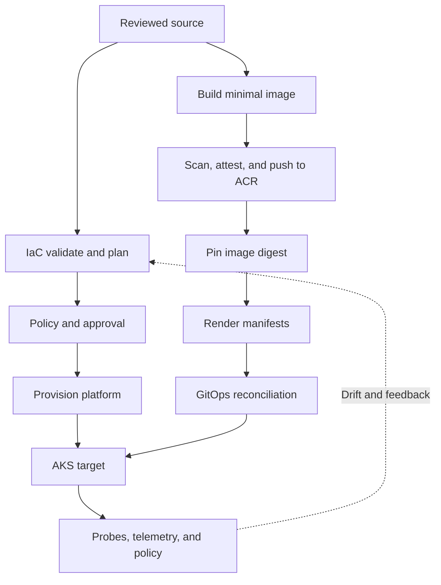

# Part V — Infrastructure and Cloud-Native Delivery

[← Complete curriculum](../README.md)

## Why this Part matters

Modern delivery includes the platform, not only the application. Networks, identities, registries, clusters, policies, and Kubernetes objects must be repeatable, reviewable, secured, and recoverable. Manual provisioning creates hidden state and drift; cloud-native packaging without runtime discipline creates fragile, overprivileged workloads.

Part V connects Infrastructure as Code (IaC) with container and Kubernetes delivery. You will learn to preview infrastructure change, protect state, build minimal traceable images, operate Azure Container Registry, model Kubernetes workloads, secure AKS, and reconcile desired state through Helm, Kustomize, and GitOps.

## Chapters

### Chapter 11 — Infrastructure as Code

Learn declarative and imperative approaches, Bicep/ARM/Terraform selection, reusable modules, environment parameters, Terraform state and locking, plan/what-if review, drift, idempotency, lifecycle, policy testing, and destructive-change protection.

[Open Chapter 11 →](chapter-11-infrastructure-as-code/README.md)

### Chapter 12 — Containers, Azure Container Registry, and Kubernetes

Learn images and digests, Dockerfile layers, multi-stage builds, scanning and runtime hardening, ACR identity and governance, Kubernetes resources, AKS architecture and operations, Helm/Kustomize/GitOps, and correct health probes.

[Open Chapter 12 →](chapter-12-containers-acr-and-kubernetes/README.md)

## Learning map

## Outcomes

After completing this Part, you should be able to:

- Explain declarative desired state, imperative orchestration, and idempotency.
- Choose Bicep, ARM JSON, or Terraform based on ownership and ecosystem needs.
- Design versioned modules with stable interfaces and environment parameters.
- Secure Terraform state and coordinate writers through locking.
- Review saved plans and Bicep what-if output without treating previews as guarantees.
- Detect drift and manage create, update, replacement, and deletion safely.
- Test IaC syntax, semantics, policy, security, cost, and behavior.
- Build small non-root images without leaking build secrets.
- Identify images by immutable registry digest and preserve provenance.
- Configure ACR identity, RBAC, networking, retention, replication, and import.
- Explain Pods, Deployments, Services, ConfigMaps, Secrets, Ingress/Gateway, and storage.
- Operate AKS using clear Microsoft/shared/customer responsibilities.
- Select Helm, Kustomize, or GitOps without mixing ownership.
- Design startup, readiness, and liveness probes that do not cause outages.

## Part project

Build and deliver a cloud-native sample service:

1. Provision an ACR and AKS sandbox using Bicep or Terraform modules.
2. Use remote state or Azure deployment history appropriately.
3. Validate, preview, scan, and approve the infrastructure change.
4. Build a multi-stage, non-root container image.
5. Scan it and push unique tags to ACR; capture the digest.
6. Give the AKS runtime pull-only access and CI push-only access.
7. Deploy Kubernetes resources with resource requests/limits and security context.
8. Externalize non-secret configuration and reference secrets securely.
9. Add startup, readiness, and liveness probes.
10. Package or overlay configuration using Helm or Kustomize.
11. Reconcile desired state with GitOps.
12. Simulate drift, failed probe, vulnerable image, and destructive infrastructure plan.
13. Document rollback/recovery, evidence, ownership, and cost cleanup.

## Safety principles

- Use sandbox subscriptions/resource groups and explicit cost limits.
- Never run apply or destroy from an unreviewed pull request.
- Treat state and saved plan files as sensitive.
- Use short-lived identities and least privilege.
- Pin module, provider, base-image, chart, and deployment references.
- Deploy images by digest for high-assurance releases.
- Never place secrets in images, Git, image tags, Terraform variables files, or rendered manifests.
- Validate destructive actions and protect stateful resources.
- Avoid privileged containers and broad cluster-admin access.
- Give every declared resource one authoritative reconciler.
- Test restoration before trusting backup or rollback claims.

## Definition of completion

- [ ] Explain the IaC plan/apply and state model
- [ ] Build reusable environment-aware modules
- [ ] Detect drift without unsafe auto-remediation
- [ ] Protect destructive changes
- [ ] Build and scan a minimal image
- [ ] Push and consume an immutable ACR digest
- [ ] Explain core Kubernetes reconciliation
- [ ] Secure and operate an AKS workload
- [ ] Choose and apply a manifest-management strategy
- [ ] Demonstrate correct probe behavior
- [ ] Complete the Part project and cleanup review
