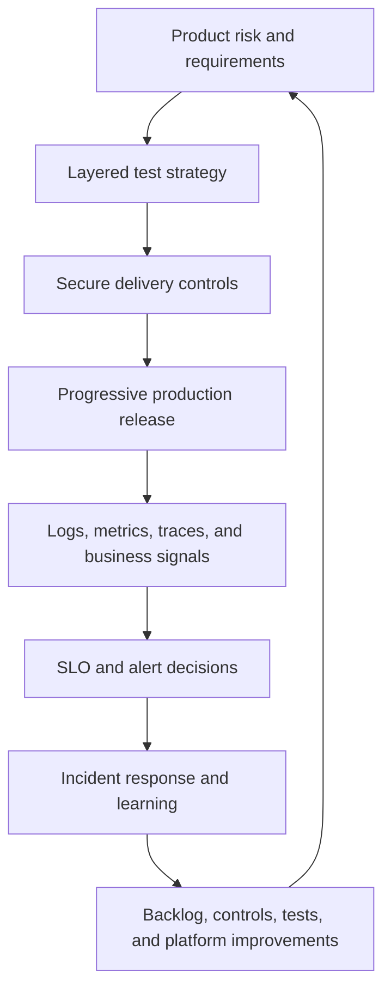

# Part VI — Quality, Security, and Operations

[← Complete curriculum](../README.md)

## Why this Part matters

Delivery speed is valuable only when the system remains trustworthy and operable. Quality engineering finds important failure modes early. Security establishes who and what may act. Observability turns production behavior into evidence. Incident and delivery metrics close the feedback loop.

Part VI integrates these disciplines rather than treating them as final pipeline stages. Tests are selected by risk, security controls span identity through runtime, and operational signals govern releases and improvement.

## Chapters

### Chapter 13 — Testing Strategy and Azure Test Plans

Learn test levels, risk-based selection, manual/exploratory/automated testing, Azure Test Plans artifacts, requirement traceability, test data/environment management, flaky-test control, coverage, and effectiveness.

[Open Chapter 13 →](chapter-13-testing-strategy-and-azure-test-plans/README.md)

### Chapter 14 — Azure DevOps Security and Compliance

Learn Microsoft Entra authentication, Azure DevOps authorization, access levels, groups and permission inheritance, least privilege, separation of duties, workload identities, PAT safety, secret lifecycle, SDLC scanning, audit evidence, and compliance design.

[Open Chapter 14 →](chapter-14-azure-devops-security-and-compliance/README.md)

### Chapter 15 — Monitoring, Feedback, and Troubleshooting

Learn observability signals, Azure Monitor and Application Insights, availability testing, SLIs/SLOs/error budgets, deployment annotations, actionable alerting, incident management, delivery performance metrics, pipeline analytics, and systematic troubleshooting.

[Open Chapter 15 →](chapter-15-monitoring-feedback-and-troubleshooting/README.md)

## Operating feedback loop

## Outcomes

After completing this Part, you should be able to:

- Design a test portfolio from risk rather than arbitrary coverage targets.
- Combine manual, exploratory, automated, functional, and nonfunctional testing.
- Operate Azure Test Plans with reusable cases, suites, runs, configurations, and traceability.
- Protect test data and manage representative environments.
- Measure and reduce flaky tests and escaped defects.
- Explain Azure DevOps authentication, access level, permission, role, and protected-resource layers.
- Replace long-lived credentials with short-lived federated identities where supported.
- Manage PATs and secrets as exceptional, scoped, expiring assets.
- Integrate SAST, SCA, secrets, IaC, container, and dynamic analysis without false assurance.
- Produce trustworthy audit/compliance evidence while protecting sensitive data.
- Design telemetry using logs, metrics, traces, profiles, events, and business outcomes.
- Create SLIs/SLOs and error-budget policies that influence delivery.
- Correlate releases with health and run effective incident response.
- Interpret delivery metrics without gaming teams.
- Troubleshoot pipelines by phase, evidence, and trust boundary.

## Part project

Build an assurance and operations model for the sample service from Parts III–V:

1. Create a risk register and map each high risk to a test/control/telemetry signal.
2. Build an Azure Test Plan with requirement-based and static suites.
3. Automate critical tests and preserve manual/exploratory coverage where appropriate.
4. Define protected test data and environment reset procedures.
5. Review Azure DevOps access, groups, PATs, service identities, resources, and audit settings.
6. Add security scanning with severity and exception policy.
7. Create an Application Insights/Azure Monitor view for golden and business signals.
8. Define availability and latency SLIs, SLOs, and an error-budget policy.
9. Add deployment annotations and version/cohort telemetry.
10. Configure actionable symptom-based alerts and a runbook.
11. Simulate a failed release and pipeline incident.
12. Complete a blameless review and update tests, controls, and documentation.

## Safety principles

- Use sanitized sandbox data; never copy production personal data casually.
- Do not reward test counts or coverage percentage without risk context.
- Treat flaky tests as reliability defects.
- Grant permissions to managed groups, not individuals, where practical.
- Prefer Microsoft Entra tokens and federated workload identity over PATs/secrets.
- Keep secrets out of code, work items, logs, test attachments, and telemetry.
- Make scan outages visible; unavailable is not passed.
- Minimize and redact audit evidence while preserving integrity.
- Alert on user-visible symptoms and actionable causes.
- Protect telemetry access because it can contain sensitive operational data.
- Use metrics to improve systems, not rank individuals.
- Preserve incident evidence before changing the system.

## Definition of completion

- [ ] Defend a risk-based test strategy
- [ ] Demonstrate Azure Test Plans traceability
- [ ] Control test data and flakiness
- [ ] Explain effective Azure DevOps access
- [ ] Inventory and reduce privileged credentials
- [ ] Implement layered SDLC scanning
- [ ] Produce an audit evidence map
- [ ] Define useful SLIs, SLOs, and alerts
- [ ] Correlate a release to production behavior
- [ ] Run a structured incident and troubleshooting exercise
- [ ] Complete the Part project
