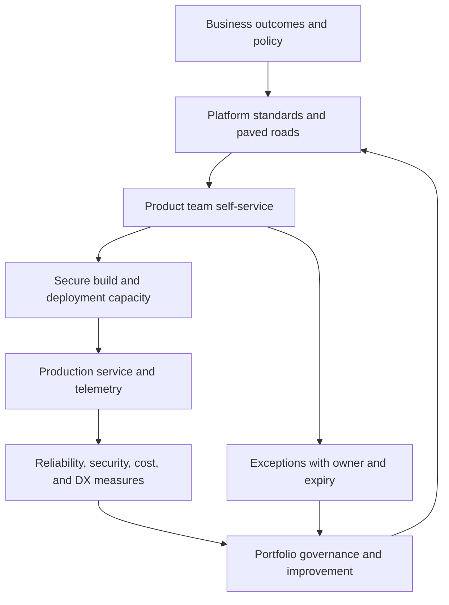

# Part VII — Enterprise Azure DevOps

[← Complete curriculum](../README.md)

## Why this Part matters

Expert Azure DevOps practice extends beyond one repository or pipeline. Enterprises need boundaries, reusable platforms, secure execution capacity, product-oriented governance, lifecycle rules, extension/API controls, continuity, cost management, migration strategies, and a developer experience teams willingly adopt.

Part VII turns the earlier technical chapters into an enterprise operating model, then proves the model through a capstone and maps the resulting competence to AZ-400 and career development.

## Chapters

### Chapter 16 — Governance, Scaling, and Platform Engineering

Learn organization/project/team boundaries, platform and product ownership, paved roads, agent-pool architecture, parallelism/capacity, naming/tagging/retention, extension governance, APIs/service hooks, cost, continuity, migration, and developer experience.

[Open Chapter 16 →](chapter-16-governance-scaling-and-platform-engineering/README.md)

### Chapter 17 — End-to-End Capstone Project

Design and implement a production-style delivery platform connecting Boards, Repos, CI, artifacts, IaC, environments, deployment strategy, security, testing, compliance, observability, recovery, and evidence.

[Open Chapter 17 →](chapter-17-end-to-end-capstone-project/README.md)

### Chapter 18 — AZ-400 Preparation and Career Development

Map hands-on capability to the current AZ-400 skills outline, build an evidence-based study plan, practice scenario decisions, create a teaching-quality portfolio, and establish continuous professional development.

[Open Chapter 18 →](chapter-18-az-400-and-career-development/README.md)

## Enterprise operating model

## Outcomes

After completing this Part, you should be able to:

- Design Azure DevOps organizations, projects, teams, repositories, and permissions around ownership.
- Operate a platform team as an internal product rather than a ticket queue.
- Build versioned paved roads with enforceable minimum controls and safe extension points.
- Design agent pools for trust isolation, network reachability, elasticity, and forensic needs.
- Model queueing, parallel-job licensing, capacity, cost, and feedback objectives.
- Govern naming, metadata, retention, archiving, deletion, and legal/audit lifecycles.
- Review Marketplace extensions, tasks, integrations, service hooks, and API identities.
- Automate administration safely with CLI/REST and idempotent reconciliation.
- Design service continuity, backup/export, migration, and recovery tests.
- Measure developer experience without weakening security or reliability.
- Produce an end-to-end architecture and working capstone with evidence.
- Prepare for the current AZ-400 objectives through scenario reasoning and hands-on proof.
- Teach the material and maintain the repository as a living reference.

## Enterprise capstone outcome

At completion, the repository should contain:

- Architecture and threat-model diagrams.
- Decision records and ownership/RACI.
- Working YAML templates and consumer pipelines.
- IaC modules and reviewed previews.
- Artifact/package/image provenance.
- Protected environments and progressive release.
- Test strategy and Test Plans traceability.
- Identity, permission, secret, scanning, and audit evidence.
- SLOs, dashboards, alerts, incident/recovery runbook.
- Capacity, cost, retention, continuity, and migration plans.
- Demo script, assessment rubric, and lessons learned.

## Safety principles

- Establish one accountable owner for each platform capability and resource.
- Prefer group-based, federated, short-lived access.
- Separate untrusted builds from privileged deployments.
- Never grant organization-wide access simply to fix one project.
- Treat extensions, tasks, APIs, webhooks, and agents as supply-chain code.
- Version the paved road and preserve controlled rollback.
- Make destructive lifecycle actions explicit and recoverable.
- Test continuity and migration with representative data before a cutover.
- Measure adoption, reliability, lead time, toil, cost, and security together.
- Use certification as a learning milestone, not a substitute for production judgment.

## Definition of mastery

- [ ] Defend an enterprise topology and permission model
- [ ] Operate a secure scalable agent platform
- [ ] Publish and evolve paved roads
- [ ] Automate governance with safe APIs
- [ ] Demonstrate cost and continuity decisions
- [ ] Complete the capstone with working evidence
- [ ] Pass scenario-based technical review
- [ ] Map gaps to the current AZ-400 outline
- [ ] Teach one chapter and handle questions
- [ ] Maintain a quarterly learning and repository update cycle
